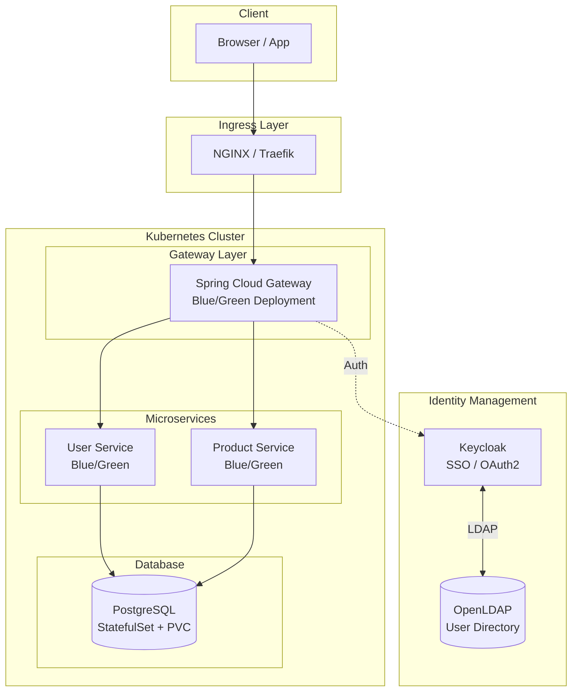
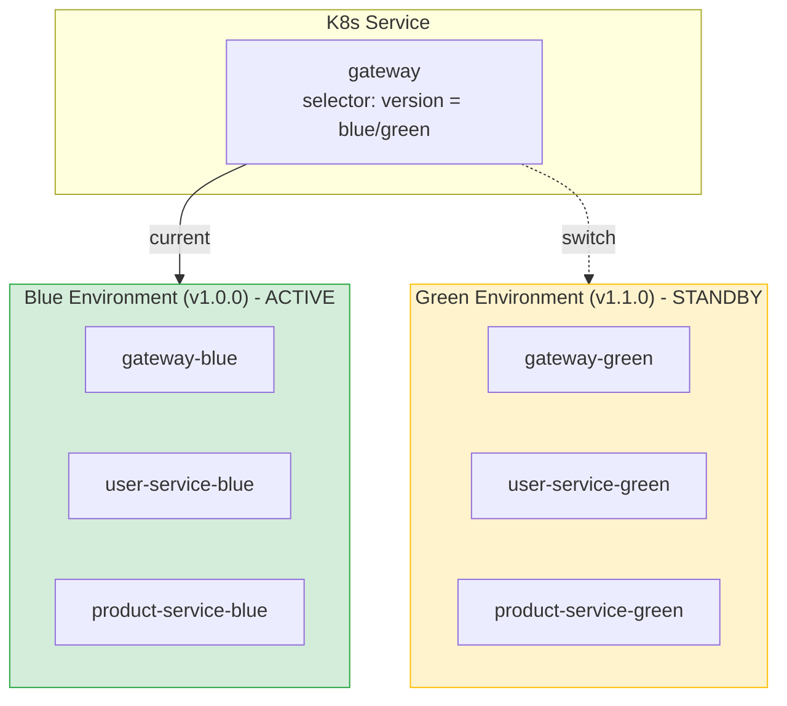
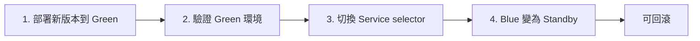
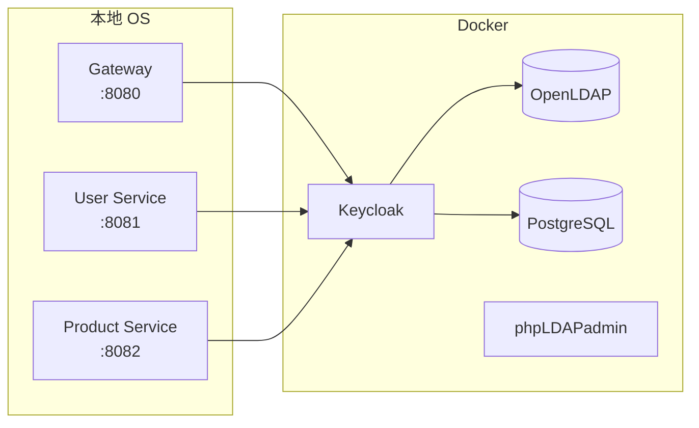
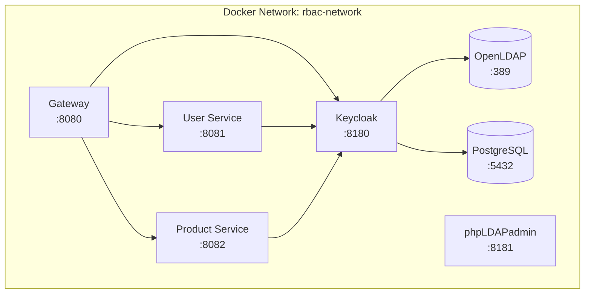
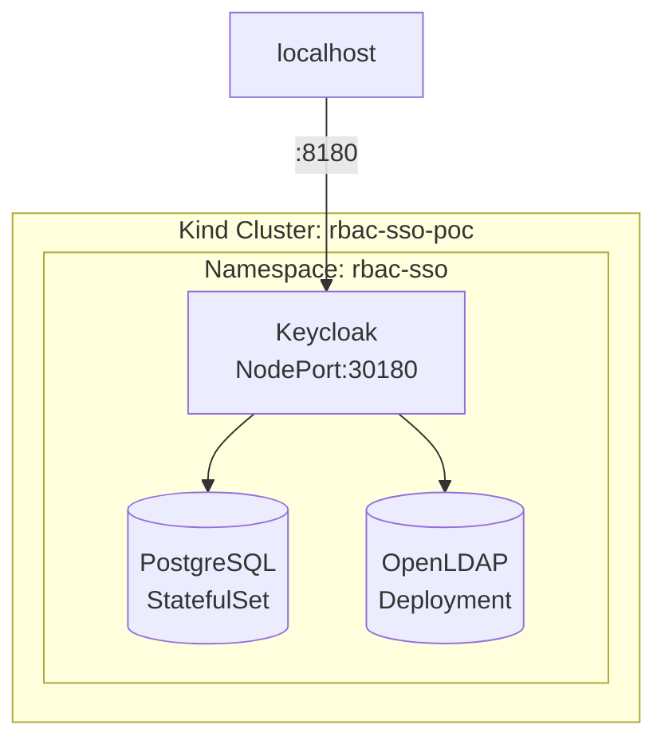
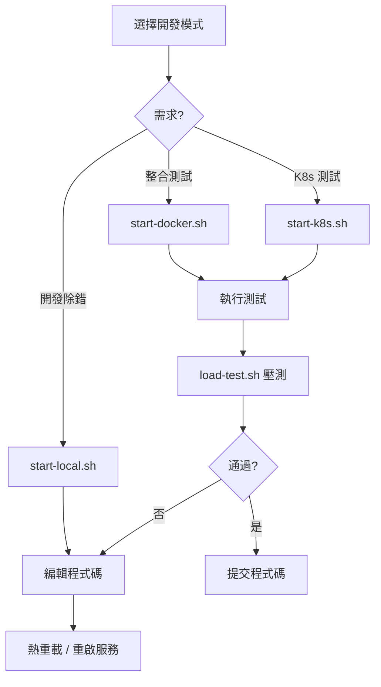

# INFRA: 基礎設施與部署文件

## 文件資訊

| 項目 | 內容 |
|------|------|
| 文件版本 | 3.1 |
| 建立日期 | 2026-01-10 |
| 最後更新 | 2026-01-10 |
| 專案代號 | ECOMMERCE-MSA-POC |
| 適用範圍 | Infrastructure & Deployment |

---

## 1. 環境總覽

### 1.1 部署環境對照

| 環境 | 用途 | 部署方式 | 資料庫 | SSO |
|------|------|----------|--------|-----|
| Local | 開發 | IDE / Gradle | H2 Memory | Keycloak (Docker) |
| Docker | 整合測試 | Docker Compose | H2 File | Keycloak (Docker) |
| SIT | 系統整合 | Kubernetes | PostgreSQL | Keycloak (K8s) |
| UAT | 使用者驗收 | Kubernetes | PostgreSQL | Keycloak (K8s) |
| Production | 正式環境 | Kubernetes | PostgreSQL | Keycloak (K8s) |

### 1.2 架構圖



---

## 2. 目錄結構

```
ecommerce-msa/
├── deploy/
│   ├── docker/
│   │   ├── docker-compose.yml           # 完整環境
│   │   ├── docker-compose.infra.yml     # 僅基礎設施（本地開發）
│   │   └── .env                         # 環境變數
│   │
│   ├── k8s/
│   │   ├── base/                        # 基礎配置
│   │   │   ├── namespace.yaml
│   │   │   ├── configmap.yaml
│   │   │   ├── secrets.yaml
│   │   │   ├── gateway/
│   │   │   ├── user-service/
│   │   │   ├── product-service/
│   │   │   └── kustomization.yaml
│   │   │
│   │   ├── overlays/                    # 環境覆蓋
│   │   │   ├── sit/
│   │   │   ├── uat/
│   │   │   └── prod/
│   │   │
│   │   └── blue-green/                  # 藍綠部署
│   │       ├── deployment-blue.yaml
│   │       ├── deployment-green.yaml
│   │       └── service.yaml
│   │
│   └── scripts/
│       ├── start-local.sh           # 本地開發 (Docker infra + OS Java)
│       ├── start-docker.sh          # Docker Compose 完整環境
│       ├── start-k8s.sh             # Kubernetes 部署 (Kind)
│       ├── load-test.sh             # 壓力測試腳本
│       ├── blue-green-deploy.sh
│       ├── blue-green-switch.sh
│       └── blue-green-verify.sh
│
└── infra/
    ├── ldap/
    │   └── bootstrap.ldif
    └── keycloak/
        └── realm-export.json
```

---

## 3. Docker Compose 配置

### 3.1 docker-compose.yml (完整環境)

```yaml
# deploy/docker/docker-compose.yml
version: '3.8'

services:
  # ============================================================
  # OpenLDAP
  # ============================================================
  openldap:
    image: osixia/openldap:1.5.0
    container_name: ecommerce-openldap
    environment:
      LDAP_ORGANISATION: "E-Commerce Corp"
      LDAP_DOMAIN: "ecommerce.local"
      LDAP_BASE_DN: "dc=ecommerce,dc=local"
      LDAP_ADMIN_PASSWORD: ${LDAP_ADMIN_PASSWORD:-admin123}
      LDAP_TLS: "false"
    ports:
      - "389:389"
    volumes:
      - ldap_data:/var/lib/ldap
      - ldap_config:/etc/ldap/slapd.d
      - ../../infra/ldap/bootstrap.ldif:/container/service/slapd/assets/config/bootstrap/ldif/custom/bootstrap.ldif
    networks:
      - ecommerce-network
    healthcheck:
      test: ["CMD", "ldapsearch", "-x", "-H", "ldap://localhost", "-b", "dc=ecommerce,dc=local"]
      interval: 30s
      timeout: 10s
      retries: 3

  # ============================================================
  # phpLDAPadmin
  # ============================================================
  phpldapadmin:
    image: osixia/phpldapadmin:0.9.0
    container_name: ecommerce-phpldapadmin
    environment:
      PHPLDAPADMIN_LDAP_HOSTS: openldap
      PHPLDAPADMIN_HTTPS: "false"
    ports:
      - "8181:80"
    depends_on:
      - openldap
    networks:
      - ecommerce-network

  # ============================================================
  # PostgreSQL (Keycloak)
  # ============================================================
  postgres:
    image: postgres:15-alpine
    container_name: ecommerce-postgres
    environment:
      POSTGRES_DB: ${POSTGRES_DB:-keycloak}
      POSTGRES_USER: ${POSTGRES_USER:-keycloak}
      POSTGRES_PASSWORD: ${POSTGRES_PASSWORD:-keycloak123}
    volumes:
      - postgres_data:/var/lib/postgresql/data
    networks:
      - ecommerce-network
    healthcheck:
      test: ["CMD-SHELL", "pg_isready -U keycloak"]
      interval: 10s
      timeout: 5s
      retries: 5

  # ============================================================
  # Keycloak
  # ============================================================
  keycloak:
    image: quay.io/keycloak/keycloak:24.0
    container_name: ecommerce-keycloak
    environment:
      KC_DB: postgres
      KC_DB_URL: jdbc:postgresql://postgres:5432/keycloak
      KC_DB_USERNAME: keycloak
      KC_DB_PASSWORD: keycloak123
      KEYCLOAK_ADMIN: admin
      KEYCLOAK_ADMIN_PASSWORD: ${KEYCLOAK_ADMIN_PASSWORD:-admin123}
      KC_HOSTNAME: localhost
      KC_HOSTNAME_PORT: 8180
      KC_HTTP_ENABLED: "true"
      KC_HEALTH_ENABLED: "true"
    command: start-dev
    ports:
      - "8180:8080"
    depends_on:
      postgres:
        condition: service_healthy
      openldap:
        condition: service_healthy
    networks:
      - ecommerce-network
    healthcheck:
      test: ["CMD-SHELL", "exec 3<>/dev/tcp/127.0.0.1/8080"]
      interval: 30s
      timeout: 10s
      retries: 10
      start_period: 120s

  # ============================================================
  # Gateway
  # ============================================================
  gateway:
    build:
      context: ../../
      dockerfile: services/gateway/Dockerfile
    container_name: ecommerce-gateway
    environment:
      SPRING_PROFILES_ACTIVE: docker
      KEYCLOAK_ISSUER_URI: http://keycloak:8080/realms/ecommerce
      USER_SERVICE_URL: http://user-service:8081
      PRODUCT_SERVICE_URL: http://product-service:8082
    ports:
      - "8080:8080"
    depends_on:
      keycloak:
        condition: service_healthy
    networks:
      - ecommerce-network
    healthcheck:
      test: ["CMD", "wget", "-q", "--spider", "http://localhost:8080/actuator/health"]
      interval: 30s
      timeout: 5s
      retries: 3
      start_period: 60s

  # ============================================================
  # User Service
  # ============================================================
  user-service:
    build:
      context: ../../
      dockerfile: services/user-service/Dockerfile
    container_name: ecommerce-user-service
    environment:
      SPRING_PROFILES_ACTIVE: docker
      KEYCLOAK_ISSUER_URI: http://keycloak:8080/realms/ecommerce
      SPRING_DATASOURCE_URL: jdbc:h2:file:/data/userdb
    volumes:
      - user_service_data:/data
    ports:
      - "8081:8081"
    depends_on:
      keycloak:
        condition: service_healthy
    networks:
      - ecommerce-network

  # ============================================================
  # Product Service
  # ============================================================
  product-service:
    build:
      context: ../../
      dockerfile: services/product-service/Dockerfile
    container_name: ecommerce-product-service
    environment:
      SPRING_PROFILES_ACTIVE: docker
      KEYCLOAK_ISSUER_URI: http://keycloak:8080/realms/ecommerce
      SPRING_DATASOURCE_URL: jdbc:h2:file:/data/productdb
    volumes:
      - product_service_data:/data
    ports:
      - "8082:8082"
    depends_on:
      keycloak:
        condition: service_healthy
    networks:
      - ecommerce-network

networks:
  ecommerce-network:
    driver: bridge

volumes:
  ldap_data:
  ldap_config:
  postgres_data:
  user_service_data:
  product_service_data:
```

### 3.2 docker-compose.infra.yml (僅基礎設施)

```yaml
# deploy/docker/docker-compose.infra.yml
# 本地開發用：僅啟動 OpenLDAP + Keycloak
version: '3.8'

services:
  openldap:
    image: osixia/openldap:1.5.0
    container_name: ecommerce-openldap
    environment:
      LDAP_ORGANISATION: "E-Commerce Corp"
      LDAP_DOMAIN: "ecommerce.local"
      LDAP_ADMIN_PASSWORD: admin123
      LDAP_TLS: "false"
    ports:
      - "389:389"
    volumes:
      - ../../infra/ldap/bootstrap.ldif:/container/service/slapd/assets/config/bootstrap/ldif/custom/bootstrap.ldif
    networks:
      - ecommerce-network

  phpldapadmin:
    image: osixia/phpldapadmin:0.9.0
    container_name: ecommerce-phpldapadmin
    environment:
      PHPLDAPADMIN_LDAP_HOSTS: openldap
      PHPLDAPADMIN_HTTPS: "false"
    ports:
      - "8181:80"
    depends_on:
      - openldap
    networks:
      - ecommerce-network

  postgres:
    image: postgres:15-alpine
    container_name: ecommerce-postgres
    environment:
      POSTGRES_DB: keycloak
      POSTGRES_USER: keycloak
      POSTGRES_PASSWORD: keycloak123
    ports:
      - "5432:5432"
    networks:
      - ecommerce-network

  keycloak:
    image: quay.io/keycloak/keycloak:24.0
    container_name: ecommerce-keycloak
    environment:
      KC_DB: postgres
      KC_DB_URL: jdbc:postgresql://postgres:5432/keycloak
      KC_DB_USERNAME: keycloak
      KC_DB_PASSWORD: keycloak123
      KEYCLOAK_ADMIN: admin
      KEYCLOAK_ADMIN_PASSWORD: admin123
      KC_HTTP_ENABLED: "true"
    command: start-dev
    ports:
      - "8180:8080"
    depends_on:
      - postgres
      - openldap
    networks:
      - ecommerce-network

networks:
  ecommerce-network:
    driver: bridge
```

---

## 4. OpenLDAP 配置

### 4.1 bootstrap.ldif

```ldif
# infra/ldap/bootstrap.ldif

# Organizational Units
dn: ou=users,dc=ecommerce,dc=local
objectClass: organizationalUnit
ou: users

dn: ou=groups,dc=ecommerce,dc=local
objectClass: organizationalUnit
ou: groups

dn: ou=services,dc=ecommerce,dc=local
objectClass: organizationalUnit
ou: services

# Service Account for Keycloak
dn: cn=keycloak,ou=services,dc=ecommerce,dc=local
objectClass: organizationalRole
objectClass: simpleSecurityObject
cn: keycloak
userPassword: keycloak123

# Admin User
dn: uid=admin.user,ou=users,dc=ecommerce,dc=local
objectClass: inetOrgPerson
objectClass: posixAccount
objectClass: shadowAccount
uid: admin.user
sn: User
givenName: Admin
cn: Admin User
uidNumber: 10001
gidNumber: 10001
userPassword: admin123
homeDirectory: /home/admin.user
mail: admin@ecommerce.local
telephoneNumber: +886-2-1234-5678

# Normal User
dn: uid=normal.user,ou=users,dc=ecommerce,dc=local
objectClass: inetOrgPerson
objectClass: posixAccount
objectClass: shadowAccount
uid: normal.user
sn: User
givenName: Normal
cn: Normal User
uidNumber: 10002
gidNumber: 10002
userPassword: user123
homeDirectory: /home/normal.user
mail: user@ecommerce.local

# Test User
dn: uid=test.user,ou=users,dc=ecommerce,dc=local
objectClass: inetOrgPerson
objectClass: posixAccount
objectClass: shadowAccount
uid: test.user
sn: User
givenName: Test
cn: Test User
uidNumber: 10003
gidNumber: 10003
userPassword: test123
homeDirectory: /home/test.user
mail: test@ecommerce.local

# Groups
dn: cn=admins,ou=groups,dc=ecommerce,dc=local
objectClass: groupOfNames
cn: admins
member: uid=admin.user,ou=users,dc=ecommerce,dc=local

dn: cn=users,ou=groups,dc=ecommerce,dc=local
objectClass: groupOfNames
cn: users
member: uid=admin.user,ou=users,dc=ecommerce,dc=local
member: uid=normal.user,ou=users,dc=ecommerce,dc=local
member: uid=test.user,ou=users,dc=ecommerce,dc=local
```

---

## 5. Keycloak 配置

### 5.1 Realm 配置步驟

1. **建立 Realm**: `ecommerce`

2. **配置 LDAP User Federation**:
   - Connection URL: `ldap://openldap:389`
   - Users DN: `ou=users,dc=ecommerce,dc=local`
   - Bind DN: `cn=admin,dc=ecommerce,dc=local`
   - Bind Credential: `admin123`

3. **配置 LDAP Group Mapper**:
   - LDAP Groups DN: `ou=groups,dc=ecommerce,dc=local`
   - Membership LDAP Attribute: `member`

4. **建立 Realm Roles**:
   - `ADMIN`
   - `USER`

5. **Group-Role Mapping**:
   - `admins` → ADMIN, USER
   - `users` → USER

6. **建立 Client**: `ecommerce-api`
   - Client authentication: ON
   - Valid redirect URIs: `http://localhost:*`

---

## 6. Kubernetes 配置

### 6.1 Base 配置

#### namespace.yaml

```yaml
# deploy/k8s/base/namespace.yaml
apiVersion: v1
kind: Namespace
metadata:
  name: ecommerce
  labels:
    app.kubernetes.io/name: ecommerce
```

#### configmap.yaml

```yaml
# deploy/k8s/base/configmap.yaml
apiVersion: v1
kind: ConfigMap
metadata:
  name: ecommerce-config
  namespace: ecommerce
data:
  SPRING_PROFILES_ACTIVE: "kubernetes"
  KEYCLOAK_ISSUER_URI: "http://keycloak:8080/realms/ecommerce"
  USER_SERVICE_URL: "http://user-service:8081"
  PRODUCT_SERVICE_URL: "http://product-service:8082"
```

#### Gateway Deployment

```yaml
# deploy/k8s/base/gateway/deployment.yaml
apiVersion: apps/v1
kind: Deployment
metadata:
  name: gateway
  namespace: ecommerce
  labels:
    app: gateway
spec:
  replicas: 2
  selector:
    matchLabels:
      app: gateway
  template:
    metadata:
      labels:
        app: gateway
    spec:
      containers:
        - name: gateway
          image: ecommerce/gateway:latest
          ports:
            - containerPort: 8080
          envFrom:
            - configMapRef:
                name: ecommerce-config
          resources:
            requests:
              memory: "256Mi"
              cpu: "250m"
            limits:
              memory: "512Mi"
              cpu: "500m"
          readinessProbe:
            httpGet:
              path: /actuator/health/readiness
              port: 8080
            initialDelaySeconds: 30
            periodSeconds: 10
          livenessProbe:
            httpGet:
              path: /actuator/health/liveness
              port: 8080
            initialDelaySeconds: 60
            periodSeconds: 30
---
apiVersion: v1
kind: Service
metadata:
  name: gateway
  namespace: ecommerce
spec:
  type: LoadBalancer
  selector:
    app: gateway
  ports:
    - port: 80
      targetPort: 8080
```

#### kustomization.yaml

```yaml
# deploy/k8s/base/kustomization.yaml
apiVersion: kustomize.config.k8s.io/v1beta1
kind: Kustomization

namespace: ecommerce

resources:
  - namespace.yaml
  - configmap.yaml
  - secrets.yaml
  - gateway/deployment.yaml
  - user-service/deployment.yaml
  - product-service/deployment.yaml

commonLabels:
  app.kubernetes.io/part-of: ecommerce
```

---

## 7. 藍綠部署 (Blue-Green Deployment)

### 7.1 藍綠部署架構



**切換流程：**



### 7.2 Blue Deployment

```yaml
# deploy/k8s/blue-green/deployment-blue.yaml
apiVersion: apps/v1
kind: Deployment
metadata:
  name: gateway-blue
  namespace: ecommerce
  labels:
    app: gateway
    version: blue
spec:
  replicas: 2
  selector:
    matchLabels:
      app: gateway
      version: blue
  template:
    metadata:
      labels:
        app: gateway
        version: blue
    spec:
      containers:
        - name: gateway
          image: ecommerce/gateway:v1.0.0
          ports:
            - containerPort: 8080
          envFrom:
            - configMapRef:
                name: ecommerce-config
          readinessProbe:
            httpGet:
              path: /actuator/health/readiness
              port: 8080
            initialDelaySeconds: 30
            periodSeconds: 10
---
apiVersion: apps/v1
kind: Deployment
metadata:
  name: user-service-blue
  namespace: ecommerce
  labels:
    app: user-service
    version: blue
spec:
  replicas: 2
  selector:
    matchLabels:
      app: user-service
      version: blue
  template:
    metadata:
      labels:
        app: user-service
        version: blue
    spec:
      containers:
        - name: user-service
          image: ecommerce/user-service:v1.0.0
          ports:
            - containerPort: 8081
          envFrom:
            - configMapRef:
                name: ecommerce-config
---
apiVersion: apps/v1
kind: Deployment
metadata:
  name: product-service-blue
  namespace: ecommerce
  labels:
    app: product-service
    version: blue
spec:
  replicas: 2
  selector:
    matchLabels:
      app: product-service
      version: blue
  template:
    metadata:
      labels:
        app: product-service
        version: blue
    spec:
      containers:
        - name: product-service
          image: ecommerce/product-service:v1.0.0
          ports:
            - containerPort: 8082
          envFrom:
            - configMapRef:
                name: ecommerce-config
```

### 7.3 Green Deployment

```yaml
# deploy/k8s/blue-green/deployment-green.yaml
apiVersion: apps/v1
kind: Deployment
metadata:
  name: gateway-green
  namespace: ecommerce
  labels:
    app: gateway
    version: green
spec:
  replicas: 2
  selector:
    matchLabels:
      app: gateway
      version: green
  template:
    metadata:
      labels:
        app: gateway
        version: green
    spec:
      containers:
        - name: gateway
          image: ecommerce/gateway:v1.1.0
          ports:
            - containerPort: 8080
          envFrom:
            - configMapRef:
                name: ecommerce-config
          readinessProbe:
            httpGet:
              path: /actuator/health/readiness
              port: 8080
            initialDelaySeconds: 30
            periodSeconds: 10
---
apiVersion: apps/v1
kind: Deployment
metadata:
  name: user-service-green
  namespace: ecommerce
spec:
  replicas: 2
  selector:
    matchLabels:
      app: user-service
      version: green
  template:
    metadata:
      labels:
        app: user-service
        version: green
    spec:
      containers:
        - name: user-service
          image: ecommerce/user-service:v1.1.0
          ports:
            - containerPort: 8081
          envFrom:
            - configMapRef:
                name: ecommerce-config
---
apiVersion: apps/v1
kind: Deployment
metadata:
  name: product-service-green
  namespace: ecommerce
spec:
  replicas: 2
  selector:
    matchLabels:
      app: product-service
      version: green
  template:
    metadata:
      labels:
        app: product-service
        version: green
    spec:
      containers:
        - name: product-service
          image: ecommerce/product-service:v1.1.0
          ports:
            - containerPort: 8082
          envFrom:
            - configMapRef:
                name: ecommerce-config
```

### 7.4 Service (流量切換)

```yaml
# deploy/k8s/blue-green/service.yaml
apiVersion: v1
kind: Service
metadata:
  name: gateway
  namespace: ecommerce
spec:
  type: LoadBalancer
  selector:
    app: gateway
    version: blue  # 切換：blue ↔ green
  ports:
    - port: 80
      targetPort: 8080
---
apiVersion: v1
kind: Service
metadata:
  name: user-service
  namespace: ecommerce
spec:
  type: ClusterIP
  selector:
    app: user-service
    version: blue  # 切換：blue ↔ green
  ports:
    - port: 8081
      targetPort: 8081
---
apiVersion: v1
kind: Service
metadata:
  name: product-service
  namespace: ecommerce
spec:
  type: ClusterIP
  selector:
    app: product-service
    version: blue  # 切換：blue ↔ green
  ports:
    - port: 8082
      targetPort: 8082
```

---

## 8. 部署腳本

### 8.1 blue-green-deploy.sh

```bash
#!/bin/bash
# deploy/scripts/blue-green-deploy.sh
# 部署新版本到待命環境

set -e

GREEN='\033[0;32m'
YELLOW='\033[1;33m'
RED='\033[0;31m'
NC='\033[0m'

NAMESPACE="ecommerce"
VERSION=${1:-"v1.1.0"}
TARGET_COLOR=${2:-"green"}

echo -e "${GREEN}======================================${NC}"
echo -e "${GREEN}  Blue-Green Deployment              ${NC}"
echo -e "${GREEN}======================================${NC}"
echo -e "  Version: ${VERSION}"
echo -e "  Target:  ${TARGET_COLOR}"
echo ""

# 確認當前版本
CURRENT=$(kubectl get svc gateway -n $NAMESPACE -o jsonpath='{.spec.selector.version}' 2>/dev/null || echo "none")
echo -e "${YELLOW}Current active: ${CURRENT}${NC}"

if [ "$CURRENT" == "$TARGET_COLOR" ]; then
    echo -e "${RED}Error: Cannot deploy to active environment!${NC}"
    exit 1
fi

# 更新 Image
echo -e "\n${YELLOW}[1/3] Updating images...${NC}"
for svc in gateway user-service product-service; do
    kubectl set image deployment/${svc}-${TARGET_COLOR} \
        ${svc}=ecommerce/${svc}:${VERSION} \
        -n $NAMESPACE
    echo "  Updated: ${svc}-${TARGET_COLOR}"
done

# 等待 Rollout
echo -e "\n${YELLOW}[2/3] Waiting for rollout...${NC}"
for svc in gateway user-service product-service; do
    kubectl rollout status deployment/${svc}-${TARGET_COLOR} \
        -n $NAMESPACE --timeout=300s
done

# 驗證健康狀態
echo -e "\n${YELLOW}[3/3] Verifying health...${NC}"
sleep 10

ALL_READY=true
for svc in gateway user-service product-service; do
    READY=$(kubectl get deployment ${svc}-${TARGET_COLOR} -n $NAMESPACE \
        -o jsonpath='{.status.readyReplicas}')
    DESIRED=$(kubectl get deployment ${svc}-${TARGET_COLOR} -n $NAMESPACE \
        -o jsonpath='{.spec.replicas}')
    
    if [ "$READY" == "$DESIRED" ]; then
        echo -e "  ${svc}: ${GREEN}✓${NC} (${READY}/${DESIRED})"
    else
        echo -e "  ${svc}: ${RED}✗${NC} (${READY}/${DESIRED})"
        ALL_READY=false
    fi
done

if [ "$ALL_READY" == "true" ]; then
    echo -e "\n${GREEN}Deployment successful!${NC}"
    echo -e "Run: ${YELLOW}./blue-green-switch.sh ${TARGET_COLOR}${NC} to switch traffic"
else
    echo -e "\n${RED}Deployment failed!${NC}"
    exit 1
fi
```

### 8.2 blue-green-switch.sh

```bash
#!/bin/bash
# deploy/scripts/blue-green-switch.sh
# 切換流量到指定環境

set -e

GREEN='\033[0;32m'
YELLOW='\033[1;33m'
RED='\033[0;31m'
NC='\033[0m'

NAMESPACE="ecommerce"
TARGET=${1:-"green"}

if [ "$TARGET" != "blue" ] && [ "$TARGET" != "green" ]; then
    echo -e "${RED}Usage: $0 [blue|green]${NC}"
    exit 1
fi

echo -e "${GREEN}======================================${NC}"
echo -e "${GREEN}  Traffic Switch                     ${NC}"
echo -e "${GREEN}======================================${NC}"

CURRENT=$(kubectl get svc gateway -n $NAMESPACE -o jsonpath='{.spec.selector.version}')
echo -e "Current: ${CURRENT} → Target: ${TARGET}"

if [ "$CURRENT" == "$TARGET" ]; then
    echo -e "${YELLOW}Already on ${TARGET}${NC}"
    exit 0
fi

# 切換所有服務
echo -e "\n${YELLOW}Switching services...${NC}"
for svc in gateway user-service product-service; do
    kubectl patch svc $svc -n $NAMESPACE \
        -p "{\"spec\":{\"selector\":{\"version\":\"${TARGET}\"}}}"
    echo "  Switched: $svc → $TARGET"
done

# 驗證
echo -e "\n${YELLOW}Verifying...${NC}"
sleep 5
for svc in gateway user-service product-service; do
    ACTUAL=$(kubectl get svc $svc -n $NAMESPACE -o jsonpath='{.spec.selector.version}')
    if [ "$ACTUAL" == "$TARGET" ]; then
        echo -e "  ${svc}: ${GREEN}✓${NC}"
    else
        echo -e "  ${svc}: ${RED}✗${NC}"
    fi
done

echo -e "\n${GREEN}Traffic switched to ${TARGET}!${NC}"
```

### 8.3 blue-green-verify.sh

```bash
#!/bin/bash
# deploy/scripts/blue-green-verify.sh
# 驗證藍綠部署狀態

set -e

GREEN='\033[0;32m'
YELLOW='\033[1;33m'
RED='\033[0;31m'
NC='\033[0m'

NAMESPACE="ecommerce"
GATEWAY_URL=${1:-"http://localhost"}
KEYCLOAK_URL=${2:-"http://localhost:8180"}

echo -e "${GREEN}======================================${NC}"
echo -e "${GREEN}  Blue-Green Verification            ${NC}"
echo -e "${GREEN}======================================${NC}"

# 1. 檢查部署狀態
echo -e "\n${YELLOW}[1/4] Deployment Status${NC}"
for color in blue green; do
    echo "  === $color ==="
    for svc in gateway user-service product-service; do
        READY=$(kubectl get deployment ${svc}-${color} -n $NAMESPACE \
            -o jsonpath='{.status.readyReplicas}' 2>/dev/null || echo "0")
        DESIRED=$(kubectl get deployment ${svc}-${color} -n $NAMESPACE \
            -o jsonpath='{.spec.replicas}' 2>/dev/null || echo "0")
        
        if [ "$READY" == "$DESIRED" ] && [ "$READY" != "0" ]; then
            echo -e "    ${svc}: ${GREEN}✓${NC} ${READY}/${DESIRED}"
        else
            echo -e "    ${svc}: ${YELLOW}○${NC} ${READY}/${DESIRED}"
        fi
    done
done

# 2. 檢查服務指向
echo -e "\n${YELLOW}[2/4] Service Selectors${NC}"
for svc in gateway user-service product-service; do
    VERSION=$(kubectl get svc $svc -n $NAMESPACE -o jsonpath='{.spec.selector.version}')
    echo "  $svc → $VERSION"
done

# 3. 取得 Token
echo -e "\n${YELLOW}[3/4] Authentication Test${NC}"
TOKEN=$(curl -s -X POST "${KEYCLOAK_URL}/realms/ecommerce/protocol/openid-connect/token" \
    -H "Content-Type: application/x-www-form-urlencoded" \
    -d "client_id=ecommerce-api" \
    -d "client_secret=YOUR_SECRET" \
    -d "grant_type=password" \
    -d "username=admin.user" \
    -d "password=admin123" 2>/dev/null | jq -r '.access_token')

if [ "$TOKEN" != "null" ] && [ -n "$TOKEN" ]; then
    echo -e "  Token: ${GREEN}✓${NC}"
else
    echo -e "  Token: ${RED}✗${NC}"
    TOKEN=""
fi

# 4. API 測試
echo -e "\n${YELLOW}[4/4] API Tests${NC}"

# Health
HTTP=$(curl -s -o /dev/null -w "%{http_code}" "${GATEWAY_URL}/actuator/health")
if [ "$HTTP" == "200" ]; then
    echo -e "  GET /actuator/health: ${GREEN}✓${NC} ($HTTP)"
else
    echo -e "  GET /actuator/health: ${RED}✗${NC} ($HTTP)"
fi

# Products (需要 Token)
if [ -n "$TOKEN" ]; then
    HTTP=$(curl -s -o /dev/null -w "%{http_code}" \
        -H "Authorization: Bearer $TOKEN" \
        "${GATEWAY_URL}/api/products")
    if [ "$HTTP" == "200" ]; then
        echo -e "  GET /api/products: ${GREEN}✓${NC} ($HTTP)"
    else
        echo -e "  GET /api/products: ${RED}✗${NC} ($HTTP)"
    fi
fi

# 總結
echo -e "\n${GREEN}======================================${NC}"
ACTIVE=$(kubectl get svc gateway -n $NAMESPACE -o jsonpath='{.spec.selector.version}')
echo -e "  Active Version: ${GREEN}${ACTIVE}${NC}"
echo -e "${GREEN}======================================${NC}"
```

---

## 9. 存取資訊

### 9.1 服務端點

| Service | Local | Docker | K8s |
|---------|-------|--------|-----|
| Gateway | :8080 | :8080 | :80 |
| User Service | :8081 | :8081 | :8081 |
| Product Service | :8082 | :8082 | :8082 |
| Keycloak | :8180 | :8180 | :8180 |
| phpLDAPadmin | :8181 | :8181 | - |

### 9.2 測試帳號

| Username | Password | Role |
|----------|----------|------|
| admin.user | admin123 | ADMIN |
| normal.user | user123 | USER |
| test.user | test123 | USER |

### 9.3 快速開始

```bash
# 1. 本地開發（僅基礎設施）
cd deploy/docker
docker-compose -f docker-compose.infra.yml up -d

# 2. IDE 啟動服務
./gradlew :services:gateway:bootRun
./gradlew :services:user-service:bootRun
./gradlew :services:product-service:bootRun

# 3. Docker 完整環境
./deploy/scripts/build-all.sh
docker-compose up -d

# 4. K8s 部署
kubectl apply -k deploy/k8s/base/

# 5. 藍綠部署
./deploy/scripts/blue-green-deploy.sh v1.1.0 green
./deploy/scripts/blue-green-switch.sh green
./deploy/scripts/blue-green-verify.sh
```

---

## 10. 附錄

### 10.1 故障排除

```bash
# 查看 Pod 日誌
kubectl logs -f deployment/gateway-blue -n ecommerce

# 查看 Pod 狀態
kubectl get pods -n ecommerce -o wide

# 進入 Pod
kubectl exec -it <pod-name> -n ecommerce -- /bin/sh

# 回滾
./deploy/scripts/blue-green-switch.sh blue
```

### 10.2 Kind Cluster (本地 K8s 測試)

本專案使用 Kind (Kubernetes in Docker) 進行本地 K8s 測試。

```bash
# 查看現有 cluster
kind get clusters

# 建立新 cluster (如果需要)
kind create cluster --name rbac-sso-poc

# 刪除 cluster
kind delete cluster --name rbac-sso-poc

# 載入本地 Docker image 到 Kind
kind load docker-image ecommerce/gateway:latest --name rbac-sso-poc
```

### 10.3 目前運行的服務

使用 `docker compose -f deploy/docker/docker-compose.infra.yml` 啟動的服務：

| 服務 | Container Name | Port | 說明 |
|------|---------------|------|------|
| OpenLDAP | rbac-openldap | 389 | LDAP 目錄服務 |
| phpLDAPadmin | rbac-phpldapadmin | 8181 | LDAP 管理介面 |
| PostgreSQL | rbac-postgres | 5432 | Keycloak 資料庫 |
| Keycloak | rbac-keycloak | 8180 | SSO / OAuth2 / OIDC |

**存取資訊：**

- Keycloak Admin Console: http://localhost:8180
  - Username: `admin`
  - Password: `admin123`

- phpLDAPadmin: http://localhost:8181
  - Login DN: `cn=admin,dc=ecommerce,dc=local`
  - Password: `admin123`

### 10.4 相關文件

- [PRD.md](./PRD.md) - 業務需求與領域建模
- [TECH.md](./TECH.md) - 技術架構文件
- [README.md](./README.md) - 專案說明

---

## 11. 快速啟動腳本

本專案提供多種部署腳本，適用於不同開發與測試情境。

### 11.1 腳本總覽

| 腳本 | 用途 | 基礎設施 | Java 應用 |
|------|------|----------|-----------|
| `start-local.sh` | 本地開發 | Docker | OS (Gradle) |
| `start-docker.sh` | 整合測試 | Docker | Docker |
| `start-k8s.sh` | K8s 測試 | Kind/K8s | K8s |
| `load-test.sh` | 壓力測試 | - | - |

### 11.2 本地開發模式 (start-local.sh)

基礎設施使用 Docker，Java 應用直接在 OS 上運行，適合開發與除錯。

```bash
# 啟動所有服務
./deploy/scripts/start-local.sh start

# 停止所有服務
./deploy/scripts/start-local.sh stop

# 重啟
./deploy/scripts/start-local.sh restart

# 查看狀態
./deploy/scripts/start-local.sh status

# 查看日誌
./deploy/scripts/start-local.sh logs           # 所有 Docker 日誌
./deploy/scripts/start-local.sh logs keycloak  # 特定服務日誌
./deploy/scripts/start-local.sh logs gateway   # Java 應用日誌
```

**架構圖：**



### 11.3 Docker 完整環境 (start-docker.sh)

所有服務都在 Docker 中運行，適合整合測試。

```bash
# 啟動所有服務
./deploy/scripts/start-docker.sh start

# 僅啟動基礎設施
./deploy/scripts/start-docker.sh start-infra

# 停止服務
./deploy/scripts/start-docker.sh stop

# 重新建置並啟動
./deploy/scripts/start-docker.sh build
./deploy/scripts/start-docker.sh restart

# 清理資源 (包含 volumes)
./deploy/scripts/start-docker.sh clean

# 查看狀態與日誌
./deploy/scripts/start-docker.sh status
./deploy/scripts/start-docker.sh logs
./deploy/scripts/start-docker.sh logs gateway
```

**架構圖：**



### 11.4 Kubernetes 環境 (start-k8s.sh)

使用 Kind 建立本地 K8s Cluster，所有服務在 K8s 中運行。

```bash
# 建立 cluster 並部署服務
./deploy/scripts/start-k8s.sh start

# 查看狀態
./deploy/scripts/start-k8s.sh status

# 停止服務 (保留 cluster)
./deploy/scripts/start-k8s.sh stop

# 刪除整個 cluster
./deploy/scripts/start-k8s.sh delete

# 查看服務日誌
./deploy/scripts/start-k8s.sh logs           # 列出可用服務
./deploy/scripts/start-k8s.sh logs keycloak  # 特定服務日誌

# Port Forwarding
./deploy/scripts/start-k8s.sh port-forward
```

**架構圖：**



### 11.5 壓力測試 (load-test.sh)

對 API 進行簡易壓力測試，支援 curl、hey、ab 三種工具。

```bash
# 執行預設測試套件
./deploy/scripts/load-test.sh test

# 測試特定端點
./deploy/scripts/load-test.sh endpoint /api/products
./deploy/scripts/load-test.sh endpoint /actuator/health

# 調整測試參數
./deploy/scripts/load-test.sh -c 50 -n 1000 test    # 50 並發，1000 請求
./deploy/scripts/load-test.sh -d 60 --tool hey test # 使用 hey，持續 60 秒

# 指定服務 URL
./deploy/scripts/load-test.sh -g http://localhost:8080 -k http://localhost:8180 test
```

**參數說明：**

| 參數 | 說明 | 預設值 |
|------|------|--------|
| `-c, --concurrent` | 並發連線數 | 10 |
| `-n, --requests` | 總請求數 | 100 |
| `-d, --duration` | 測試持續時間 (秒) | 30 |
| `-g, --gateway` | Gateway URL | http://localhost:8080 |
| `-k, --keycloak` | Keycloak URL | http://localhost:8180 |
| `--tool` | 壓測工具 (curl/hey/ab) | curl |

**測試套件內容：**

1. Health Check (`/actuator/health`)
2. 產品列表查詢 (`/api/products`)
3. 使用者查詢 (`/api/users`)
4. Token 端點測試

**環境變數：**

```bash
export KEYCLOAK_URL=http://localhost:8180
export GATEWAY_URL=http://localhost:8080
export CLIENT_ID=ecommerce-api
export USERNAME=admin.user
export PASSWORD=admin123
```

### 11.6 使用流程



---

## 12. 實作狀態

### 12.1 分支策略

| 分支 | 稽核機制 | 說明 |
|------|----------|------|
| `main` | Spring AOP | 使用 `@Auditable` 註解 |
| `domain-event-for-audit` | Domain Events | 使用領域事件發布 |

> **重要**: 兩個分支的稽核機制是不可變的設計決策。除稽核機制外，所有功能完全一致。

### 12.2 測試統計

| 模組 | 測試數 | 覆蓋率 | 狀態 |
|------|--------|--------|------|
| product-service | 124+ | 96% | ✅ |
| user-service | 10+ | 96% | ✅ |
| gateway-service | 10+ | 92% | ✅ |
| audit-lib | 150+ | 67% | ⚠️ |
| scenario-tests | 18 scenarios | - | ✅ |
| **總計** | **350+** | **80%+** | ✅ |

### 12.3 已完成基礎設施

| 組件 | 狀態 | 說明 |
|------|------|------|
| Docker Compose 開發環境 | ✅ | keycloak, postgres, openldap |
| Kubernetes 部署腳本 | ✅ | kustomize, blue-green |
| OpenLDAP 初始化 | ✅ | bootstrap.ldif |
| Keycloak Realm 配置 | ✅ | LDAP federation, group mapping |
| Gradle 多模組專案 | ✅ | 共用函式庫 + 微服務 |
| 壓力測試腳本 | ✅ | load-test.sh |
| 本地開發腳本 | ✅ | start-local.sh |

---

## 附錄 A: 相關文件

- [PRD.md](./PRD.md) - 產品需求文件
- [TECH.md](./TECH.md) - 技術架構文件
- [README.md](./README.md) - 專案說明

---

*— INFRA 文件結束 —*
