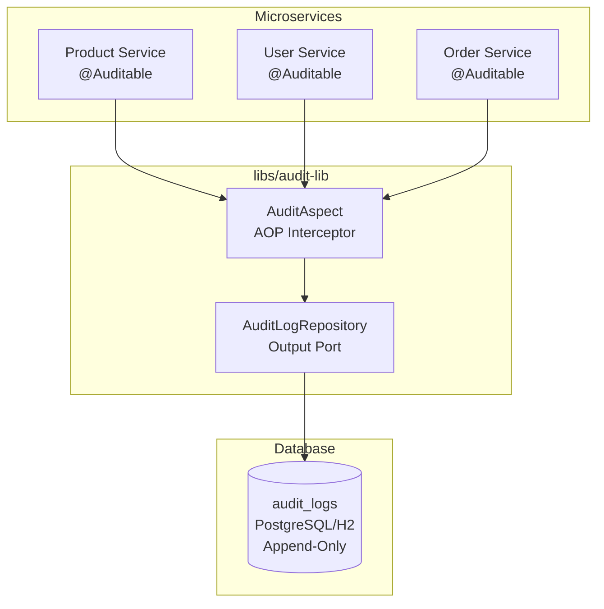
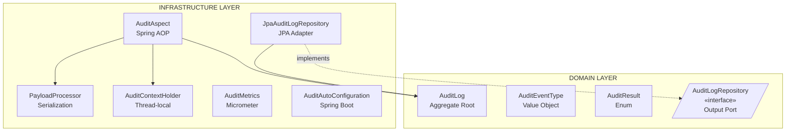
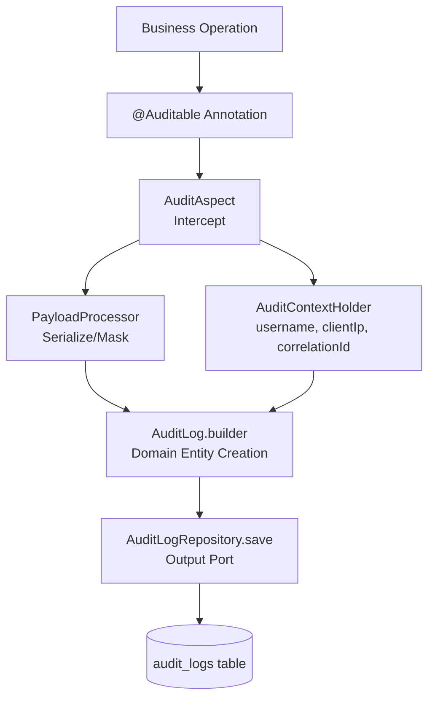
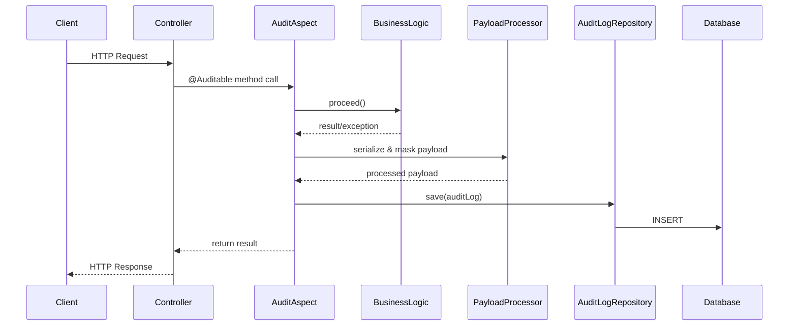
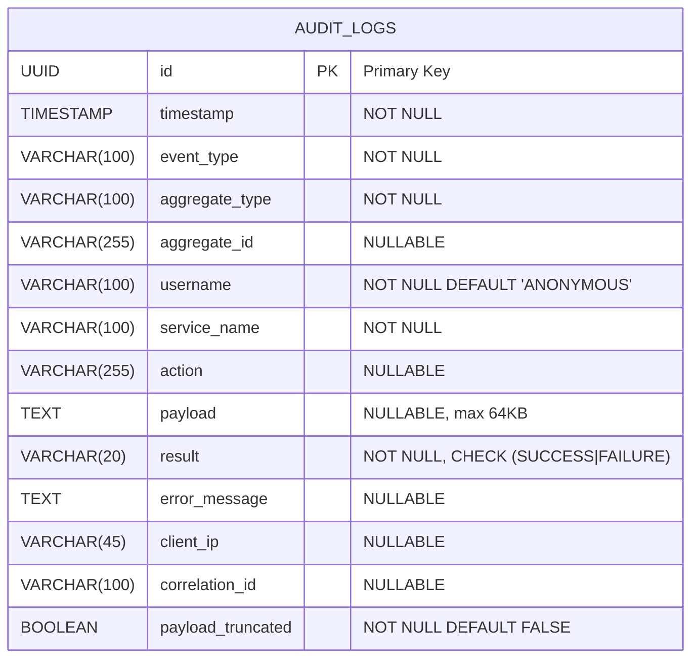
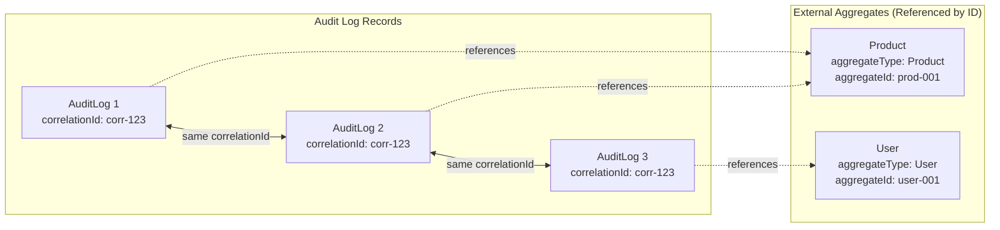
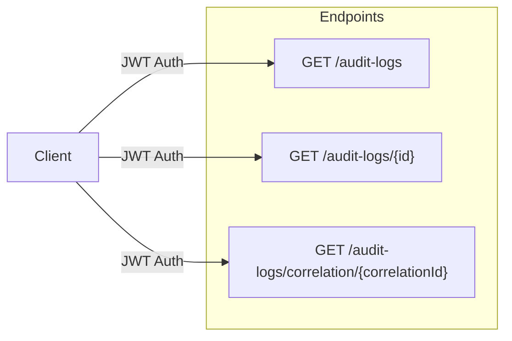
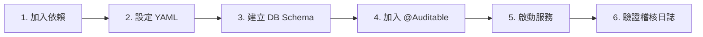
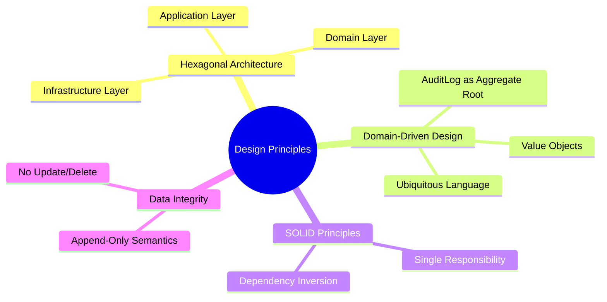

# RBAC-SSO-POC

基於 Hexagonal Architecture 的 RBAC + SSO 概念驗證專案，包含共用稽核函式庫功能。

## 目錄

- [專案概述](#專案概述)
- [技術堆疊](#技術堆疊)
- [系統架構](#系統架構)
- [ER Diagram](#er-diagram)
- [API 文件](#api-文件)
- [快速開始](#快速開始)
- [測試範例資料](#測試範例資料)
- [專案結構](#專案結構)

## 專案概述

本專案實作共用稽核函式庫 (Shared Audit Library)，提供兩種稽核機制：

1. **AOP (Aspect-Oriented Programming)**：透過 `@Auditable` annotation 自動攔截方法
2. **Domain Event**：透過領域事件發布，提供更靈活的稽核控制

函式庫可供不同微服務引用，提供宣告式和程式化的稽核記錄功能。

### 分支說明

| 分支 | 說明 |
|------|------|
| `main` | 主分支，包含 AOP 與 Domain Event 雙機制 |
| `domain-event-for-audit` | Domain Event 稽核機制開發分支 |

### 核心特性

- **雙重稽核機制**：支援 AOP 註解式與 Domain Event 程式化兩種方式
- **宣告式稽核**：透過 `@Auditable` annotation 標註需要稽核的方法
- **程式化稽核**：透過 `AuditEventPublisher` 發布稽核事件
- **業務邏輯隔離**：稽核失敗不會影響業務操作 (FR-005)
- **自動資訊擷取**：自動記錄操作者、時間戳記、Client IP、執行結果
- **敏感資料遮罩**：支援欄位級別的資料遮罩
- **可觀測性**：整合 Micrometer 提供 metrics 與 health indicators
- **OAuth2 安全性**：支援 North-South 與 East-West 安全控制
- **Spring Cloud Contract**：提供消費者驅動合約測試

## 技術堆疊

| 類別 | 技術 | 版本 |
|------|------|------|
| 語言 | Java | 17 (LTS) |
| 框架 | Spring Boot | 3.3.x |
| AOP | Spring AOP | 6.1.x |
| 事件 | Spring Events | 6.1.x |
| 資料存取 | Spring Data JPA | 3.3.x |
| 安全性 | Spring Security OAuth2 | 6.x |
| 監控 | Micrometer | 1.12.x |
| 資料庫 | H2 (Dev) / PostgreSQL (Prod) | - |
| 測試 | JUnit 5, ArchUnit | 1.2.x |
| 合約測試 | Spring Cloud Contract | 4.1.x |
| 建置 | Gradle | 8.5 |

## 系統架構

### 整體架構圖



### Hexagonal Architecture (Audit Library 內部)



### 資料流程



### 元件互動時序圖



## ER Diagram

### 資料模型



### 索引設計

| 索引名稱 | 欄位 | 用途 |
|----------|------|------|
| `idx_audit_timestamp` | `timestamp DESC` | 時間範圍查詢 |
| `idx_audit_username` | `username, timestamp DESC` | 依使用者查詢 |
| `idx_audit_aggregate` | `aggregate_type, aggregate_id, timestamp DESC` | 依實體查詢 |
| `idx_audit_event_type` | `event_type, timestamp DESC` | 依事件類型查詢 |
| `idx_audit_service` | `service_name, timestamp DESC` | 依服務查詢 |
| `idx_audit_correlation` | `correlation_id` (partial) | 關聯查詢 |

### DDL

```sql
CREATE TABLE audit_logs (
    id                UUID            PRIMARY KEY,
    timestamp         TIMESTAMP       NOT NULL,
    event_type        VARCHAR(100)    NOT NULL,
    aggregate_type    VARCHAR(100)    NOT NULL,
    aggregate_id      VARCHAR(255),
    username          VARCHAR(100)    NOT NULL DEFAULT 'ANONYMOUS',
    service_name      VARCHAR(100)    NOT NULL,
    action            VARCHAR(255),
    payload           TEXT,
    result            VARCHAR(20)     NOT NULL,
    error_message     TEXT,
    client_ip         VARCHAR(45),
    correlation_id    VARCHAR(100),
    payload_truncated BOOLEAN         NOT NULL DEFAULT FALSE,

    CONSTRAINT chk_result CHECK (result IN ('SUCCESS', 'FAILURE')),
    CONSTRAINT chk_payload_size CHECK (LENGTH(payload) <= 65536)
);

-- Performance indexes
CREATE INDEX idx_audit_timestamp ON audit_logs(timestamp DESC);
CREATE INDEX idx_audit_username ON audit_logs(username, timestamp DESC);
CREATE INDEX idx_audit_aggregate ON audit_logs(aggregate_type, aggregate_id, timestamp DESC);
CREATE INDEX idx_audit_event_type ON audit_logs(event_type, timestamp DESC);
CREATE INDEX idx_audit_service ON audit_logs(service_name, timestamp DESC);
CREATE INDEX idx_audit_correlation ON audit_logs(correlation_id) WHERE correlation_id IS NOT NULL;
```

### 實體關係說明



> **Note**: AuditLog 是獨立的 Aggregate，透過 `aggregateType` 和 `aggregateId` 字串參照外部實體，不建立直接的資料庫關聯。多個 AuditLog 可透過 `correlationId` 關聯同一交易中的操作。

## API 文件

### Base URL

```
/api/v1
```

### Endpoints 概覽



### 1. 查詢稽核日誌

```http
GET /api/v1/audit-logs
```

**Query Parameters:**

| 參數 | 類型 | 必填 | 說明 | 範例 |
|------|------|------|------|------|
| `username` | string | No | 依執行者過濾 | `admin@example.com` |
| `aggregateType` | string | No | 依實體類型過濾 | `Product` |
| `aggregateId` | string | No | 依實體 ID 過濾 | `prod-12345` |
| `eventType` | string | No | 依事件類型過濾 | `PRODUCT_CREATED` |
| `serviceName` | string | No | 依服務名稱過濾 | `product-service` |
| `startTime` | datetime | No | 起始時間 (ISO 8601) | `2026-01-01T00:00:00Z` |
| `endTime` | datetime | No | 結束時間 (ISO 8601) | `2026-01-31T23:59:59Z` |
| `result` | enum | No | 依結果過濾 | `SUCCESS`, `FAILURE` |
| `page` | int | No | 頁碼 (0-indexed) | `0` |
| `size` | int | No | 每頁筆數 (1-100) | `20` |

**Response:**

```json
{
  "content": [
    {
      "id": "550e8400-e29b-41d4-a716-446655440001",
      "timestamp": "2026-01-10T08:30:00.123Z",
      "eventType": "PRODUCT_CREATED",
      "aggregateType": "Product",
      "aggregateId": "prod-12345",
      "username": "admin@example.com",
      "serviceName": "product-service",
      "action": "createProduct",
      "payload": "{\"productCode\":\"SKU-001\",\"productName\":\"Widget\"}",
      "result": "SUCCESS",
      "errorMessage": null,
      "clientIp": "192.168.1.100",
      "correlationId": "corr-abc-123",
      "payloadTruncated": false
    }
  ],
  "page": 0,
  "size": 20,
  "totalElements": 150,
  "totalPages": 8,
  "first": true,
  "last": false
}
```

### 2. 依 ID 查詢單筆稽核日誌

```http
GET /api/v1/audit-logs/{id}
```

**Path Parameters:**

| 參數 | 類型 | 說明 |
|------|------|------|
| `id` | UUID | 稽核日誌 ID |

### 3. 依 Correlation ID 查詢關聯日誌

```http
GET /api/v1/audit-logs/correlation/{correlationId}
```

**Path Parameters:**

| 參數 | 類型 | 說明 |
|------|------|------|
| `correlationId` | string | 關聯 ID |

### Authentication

所有 API 需要 JWT Bearer Token：

```http
Authorization: Bearer <jwt-token>
```

### Metrics Endpoints

| Endpoint | 說明 |
|----------|------|
| `GET /actuator/metrics/audit.events.total` | 總稽核事件數 |
| `GET /actuator/metrics/audit.events.failed` | 失敗的稽核擷取數 |
| `GET /actuator/metrics/audit.capture.latency` | 擷取延遲時間 |
| `GET /actuator/health` | 包含 audit 健康狀態 |

## 快速開始

### 1. 加入依賴

```groovy
dependencies {
    implementation project(':libs:audit-lib')
}
```

### 2. 設定 application.yml

```yaml
audit:
  enabled: true
  service-name: ${spring.application.name}
  payload:
    max-size: 65536
  masking:
    default-fields:
      - password
      - secret
      - token
```

### 3. 使用稽核機制

#### 方式一：AOP 方式 (@Auditable)

適合簡單的方法級稽核，自動攔截並記錄。

```java
@RestController
@RequestMapping("/api/products")
public class ProductController {

    @PostMapping
    @Auditable(eventType = "PRODUCT_CREATED", resourceType = "Product")
    public ApiResponse<UUID> createProduct(@RequestBody CreateProductRequest req) {
        // Business logic - 無需任何稽核相關程式碼
        return ApiResponse.success(productId, "Product created");
    }

    @PostMapping("/change-password")
    @Auditable(
        eventType = "USER_PASSWORD_CHANGED",
        resourceType = "User",
        maskFields = {"oldPassword", "newPassword"}
    )
    public ApiResponse<Void> changePassword(@RequestBody ChangePasswordRequest req) {
        // 密碼欄位會自動遮罩為 "****"
        return ApiResponse.success(null, "Password changed");
    }
}
```

#### 方式二：Domain Event 方式 (推薦)

適合需要更細緻控制的場景，如複雜業務流程、批次操作、或條件式稽核。

```java
@Service
public class ProductService {

    private final AuditEventPublisher eventPublisher;
    private final AuditEventBuilder auditEventBuilder;
    private final ProductRepository productRepository;

    public Product createProduct(CreateProductCommand cmd) {
        // 1. 執行業務邏輯
        Product product = Product.create(cmd);
        productRepository.save(product);

        // 2. 發布稽核事件
        eventPublisher.publish(auditEventBuilder.success()
            .eventType("PRODUCT_CREATED")
            .aggregateType("Product")
            .aggregateId(product.getId().toString())
            .action("createProduct")
            .payload(product)
            .build());

        return product;
    }

    public void updateProduct(UpdateProductCommand cmd) {
        try {
            Product product = productRepository.findById(cmd.productId())
                .orElseThrow(() -> new ProductNotFoundException(cmd.productId()));

            product.update(cmd);
            productRepository.save(product);

            eventPublisher.publish(auditEventBuilder.success()
                .eventType("PRODUCT_UPDATED")
                .aggregateType("Product")
                .aggregateId(product.getId().toString())
                .action("updateProduct")
                .payload(cmd)
                .build());

        } catch (Exception e) {
            // 記錄失敗事件
            eventPublisher.publish(auditEventBuilder.failure(e)
                .eventType("PRODUCT_UPDATE_FAILED")
                .aggregateType("Product")
                .aggregateId(cmd.productId())
                .action("updateProduct")
                .build());

            throw e;
        }
    }
}
```

### 整合流程



## 測試範例資料

### 成功操作

```json
{
  "id": "550e8400-e29b-41d4-a716-446655440001",
  "timestamp": "2026-01-10T08:30:00.123Z",
  "eventType": "PRODUCT_CREATED",
  "aggregateType": "Product",
  "aggregateId": "prod-12345",
  "username": "admin@example.com",
  "serviceName": "product-service",
  "action": "createProduct",
  "payload": "{\"productCode\":\"SKU-001\",\"productName\":\"Widget\",\"price\":99.99}",
  "result": "SUCCESS",
  "errorMessage": null,
  "clientIp": "192.168.1.100",
  "correlationId": "corr-abc-123",
  "payloadTruncated": false
}
```

### 失敗操作

```json
{
  "id": "550e8400-e29b-41d4-a716-446655440002",
  "timestamp": "2026-01-10T08:31:00.456Z",
  "eventType": "PRODUCT_UPDATED",
  "aggregateType": "Product",
  "aggregateId": "prod-99999",
  "username": "user@example.com",
  "serviceName": "product-service",
  "action": "updateProduct",
  "payload": "{\"productId\":\"prod-99999\",\"newPrice\":150.00}",
  "result": "FAILURE",
  "errorMessage": "ProductNotFoundException: Product with id prod-99999 not found",
  "clientIp": "192.168.1.101",
  "correlationId": "corr-def-456",
  "payloadTruncated": false
}
```

### 敏感資料遮罩

```json
{
  "id": "550e8400-e29b-41d4-a716-446655440003",
  "timestamp": "2026-01-10T08:32:00.789Z",
  "eventType": "USER_PASSWORD_CHANGED",
  "aggregateType": "User",
  "aggregateId": "user-67890",
  "username": "user@example.com",
  "serviceName": "user-service",
  "action": "changePassword",
  "payload": "{\"userId\":\"user-67890\",\"oldPassword\":\"****\",\"newPassword\":\"****\"}",
  "result": "SUCCESS",
  "errorMessage": null,
  "clientIp": "192.168.1.102",
  "correlationId": null,
  "payloadTruncated": false
}
```

### Payload 截斷

```json
{
  "id": "550e8400-e29b-41d4-a716-446655440004",
  "timestamp": "2026-01-10T08:33:00.012Z",
  "eventType": "BULK_IMPORT",
  "aggregateType": "Product",
  "aggregateId": null,
  "username": "system",
  "serviceName": "product-service",
  "action": "bulkImportProducts",
  "payload": "{\"_truncated\":true,\"_originalSize\":128000,\"_summary\":{\"recordCount\":500,\"batchId\":\"batch-123\"}}",
  "result": "SUCCESS",
  "errorMessage": null,
  "clientIp": "10.0.0.50",
  "correlationId": "corr-bulk-789",
  "payloadTruncated": true
}
```

## 專案結構

```
rbac-sso-poc/
├── libs/
│   └── audit-lib/                          # 共用稽核函式庫
│       ├── build.gradle
│       └── src/
│           ├── main/java/com/example/audit/
│           │   ├── annotation/
│           │   │   └── Auditable.java              # @Auditable 註解 (AOP)
│           │   ├── domain/
│           │   │   ├── model/
│           │   │   │   ├── AuditLog.java           # 稽核日誌實體
│           │   │   │   └── AuditEventType.java     # 事件類型值物件
│           │   │   ├── event/                      # Domain Event
│           │   │   │   ├── DomainEvent.java        # 基礎事件介面
│           │   │   │   ├── AuditableDomainEvent.java # 可稽核事件介面
│           │   │   │   └── BaseAuditEvent.java     # 事件基礎類別
│           │   │   └── port/
│           │   │       ├── AuditLogRepository.java # Output Port
│           │   │       └── AuditEventPublisher.java # 事件發布 Port
│           │   ├── application/
│           │   │   ├── service/
│           │   │   │   └── AuditQueryService.java  # 查詢服務
│           │   │   ├── event/
│           │   │   │   └── AuditEventBuilder.java  # 事件建構器
│           │   │   └── dto/
│           │   │       └── AuditLogView.java       # 查詢 DTO
│           │   └── infrastructure/
│           │       ├── aspect/
│           │       │   └── AuditAspect.java        # AOP 切面
│           │       ├── event/                      # Domain Event Adapter
│           │       │   ├── SpringAuditEventPublisher.java
│           │       │   └── AuditDomainEventListener.java
│           │       ├── processor/
│           │       │   ├── PayloadProcessor.java   # Payload 處理
│           │       │   └── FieldMasker.java        # 欄位遮罩
│           │       ├── persistence/
│           │       │   └── JpaAuditLogRepository.java
│           │       ├── context/
│           │       │   └── AuditContextHolder.java # Thread-local context
│           │       ├── security/                   # OAuth2 安全
│           │       │   ├── ServiceTokenProvider.java
│           │       │   └── ServiceAuthInterceptor.java
│           │       ├── metrics/
│           │       │   └── AuditMetrics.java       # Micrometer metrics
│           │       ├── health/
│           │       │   └── AuditHealthIndicator.java
│           │       └── config/
│           │           ├── AuditAutoConfiguration.java
│           │           ├── SecurityAutoConfiguration.java
│           │           └── ServiceAuthConfiguration.java
│           └── test/java/com/example/audit/
│               ├── unit/
│               ├── integration/
│               └── contract/
├── specs/
│   └── 001-shared-audit-lib/               # 功能規格文件
│       ├── spec.md                         # 功能規格
│       ├── plan.md                         # 實作計畫
│       ├── tasks.md                        # 任務清單
│       ├── data-model.md                   # 資料模型
│       ├── quickstart.md                   # 快速入門
│       └── contracts/
│           ├── audit-annotation.md         # Annotation 合約
│           └── audit-api.yaml              # OpenAPI 規格
├── build.gradle
├── settings.gradle
└── README.md                               # 本文件
```

## 效能目標

| 指標 | 目標 |
|------|------|
| 稽核擷取延遲 | < 50ms |
| 寫入吞吐量 | 100-500 events/second |
| 查詢回應時間 | < 5 seconds (1M records) |
| Payload 大小限制 | 64 KB |

## 設計原則

本專案遵循以下架構原則：



## License

Private - Internal Use Only
