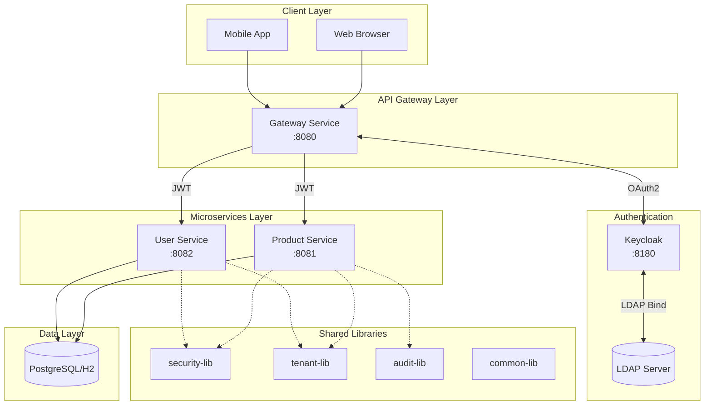
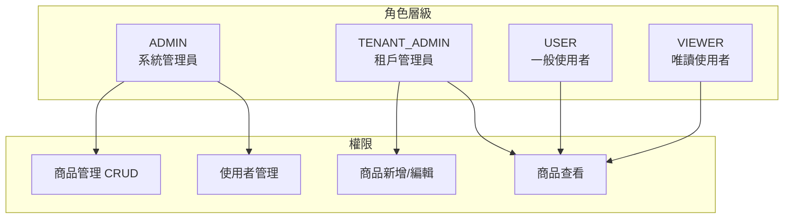
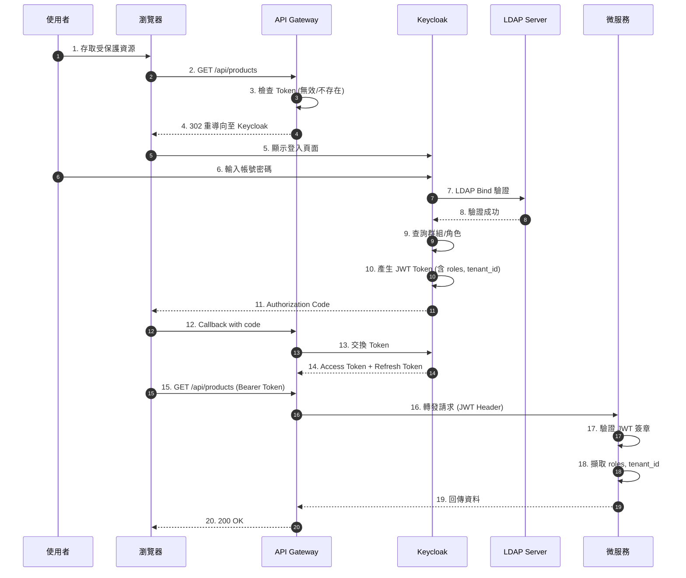
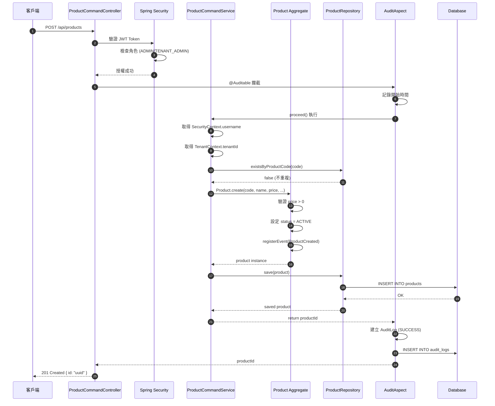
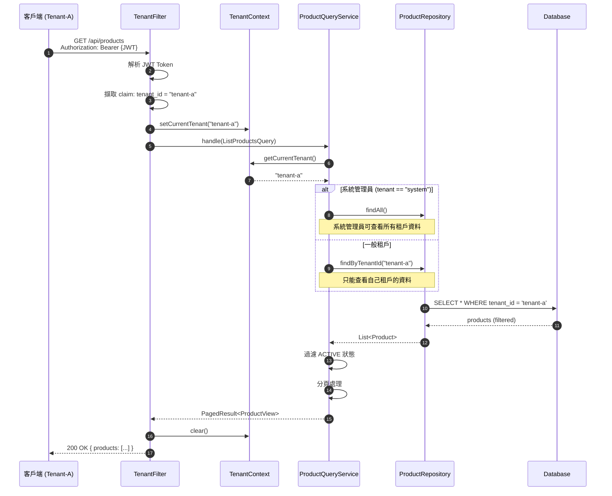
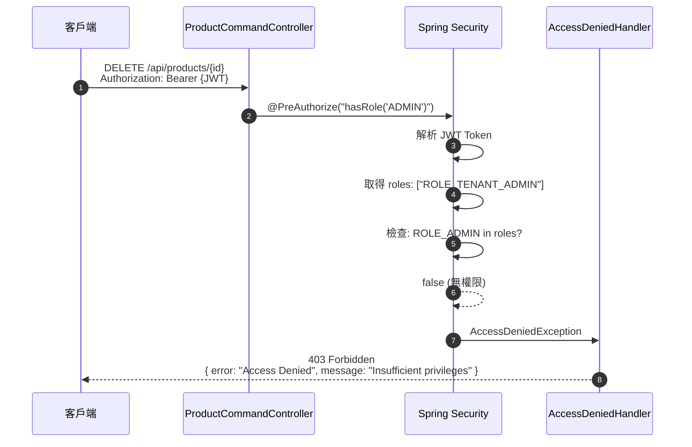
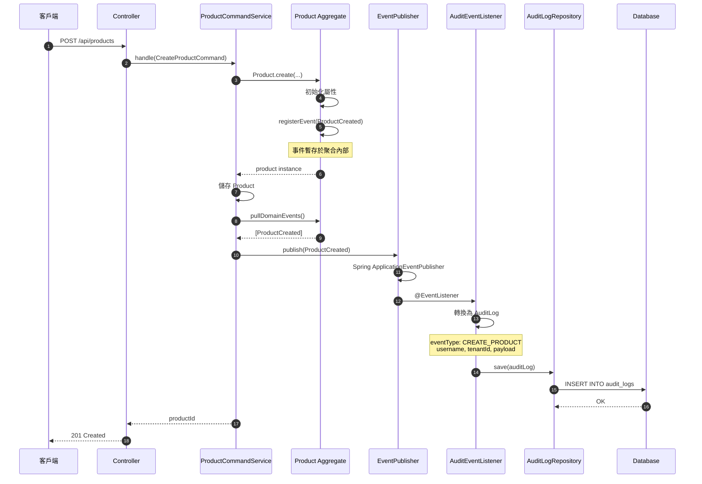
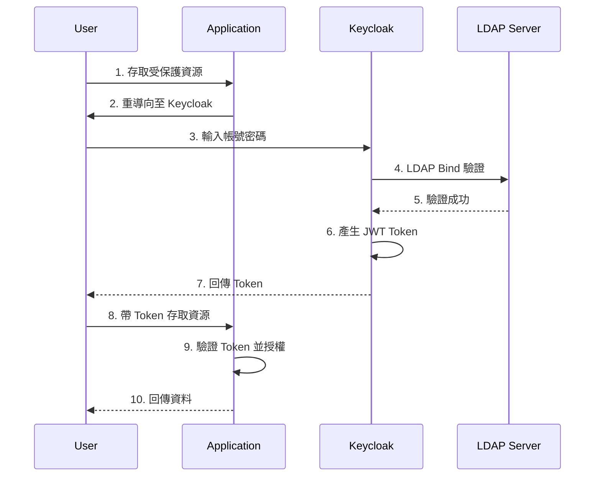

# RBAC-SSO-POC

> **📌 當前分支: `domain-event-for-audit`** - 使用 Domain Event 機制實作稽核日誌

多租戶電子商務平台 POC - 基於 Hexagonal Architecture 的 RBAC + SSO 實作，整合 Keycloak LDAP 認證與稽核功能。

## 專案狀態

| 指標 | 狀態 |
|------|------|
| **建置狀態** | ✅ BUILD SUCCESSFUL |
| **測試數量** | 344 tests |
| **測試通過率** | 100% (0 failures) |
| **product-service 覆蓋率** | 96% |
| **user-service 覆蓋率** | 96% |
| **gateway-service 覆蓋率** | 92% |
| **Cucumber 場景** | 18 scenarios |

## 目錄

- [專案概述](#專案概述)
- [分支策略](#分支策略)
- [系統架構](#系統架構)
- [RBAC 權限控制](#rbac-權限控制)
- [微服務說明](#微服務說明)
- [場景序列圖](#場景序列圖)
- [測試案例說明](#測試案例說明)
- [Keycloak LDAP 整合教學](#keycloak-ldap-整合教學)
- [快速開始](#快速開始)
- [專案結構](#專案結構)

---

## 專案概述

本專案實作多租戶電子商務平台的核心功能，展示以下技術概念：

### 核心特性

| 特性 | 說明 | 狀態 |
|------|------|:----:|
| **多租戶架構** | 租戶資料隔離，TenantContext 管理 | ✅ |
| **RBAC 權限控制** | 基於角色的存取控制，整合 Spring Security | ✅ |
| **SSO 單一登入** | OAuth2/OIDC + Keycloak 整合 | ✅ |
| **Hexagonal Architecture** | 六角架構，Ports & Adapters 模式 | ✅ |
| **DDD 領域驅動設計** | Aggregate、Value Objects、Domain Events | ✅ |
| **CQRS 模式** | 命令/查詢分離 | ✅ |
| **稽核日誌** | Spring AOP / Domain Event 雙機制 | ✅ |
| **BDD 測試** | Cucumber + 中文 Gherkin | ✅ |

---

## 分支策略

| 分支 | 稽核機制 | 說明 |
|------|----------|------|
| `main` | **Spring AOP** | 透過 `@Auditable` 註解自動攔截 |
| `domain-event-for-audit` | **Domain Event** | 透過領域事件發布，提供細緻控制 |

> **重要設計原則**: 兩個分支的稽核機制差異是**不可變的架構決策**。除稽核日誌實作方式外，所有 RBAC、SSO、多租戶等核心功能完全一致。

### Spring AOP 稽核 (main 分支)

```java
@Auditable(eventType = AuditEventType.CREATE_PRODUCT)
public UUID handle(CreateProductCommand cmd) {
    // 業務邏輯 - 稽核透過 AOP 自動攔截，無需額外程式碼
}
```

### Domain Event 稽核 (domain-event-for-audit 分支)

```java
public UUID handle(CreateProductCommand cmd) {
    Product product = Product.create(...);
    eventPublisher.publish(product.pullDomainEvents());
    // ProductCreated 事件由 AuditDomainEventListener 捕獲並記錄
}
```

---

## 系統架構

### 整體架構



### Hexagonal Architecture (Product Service)


---

## RBAC 權限控制

### 角色層級



### 權限對照表

| 端點 | ADMIN | TENANT_ADMIN | USER | VIEWER |
|------|:-----:|:------------:|:----:|:------:|
| `GET /api/products` | ✅ | ✅ | ✅ | ✅ |
| `GET /api/products/{id}` | ✅ | ✅ | ✅ | ✅ |
| `POST /api/products` | ✅ | ✅ | ❌ | ❌ |
| `PUT /api/products/{id}` | ✅ | ✅ | ❌ | ❌ |
| `DELETE /api/products/{id}` | ✅ | ❌ | ❌ | ❌ |
| `GET /api/users/me` | ✅ | ✅ | ✅ | ✅ |

---

## 微服務說明

### Product Service (:8081)

完整 DDD 實作的商品管理服務。

| 方法 | 端點 | 說明 | 權限 |
|------|------|------|------|
| GET | `/api/products` | 查詢商品列表 (分頁) | 已認證 |
| GET | `/api/products/{id}` | 查詢單一商品 | 已認證 |
| POST | `/api/products` | 建立商品 | ADMIN, TENANT_ADMIN |
| PUT | `/api/products/{id}` | 更新商品 | ADMIN, TENANT_ADMIN |
| DELETE | `/api/products/{id}` | 刪除商品 (軟刪除) | ADMIN |

### User Service (:8082)

使用者個人資料服務，從 JWT Token 擷取使用者資訊。

| 方法 | 端點 | 說明 | 權限 |
|------|------|------|------|
| GET | `/api/users/me` | 取得當前使用者資訊 | 已認證 |

### Gateway Service (:8080)

Spring Cloud Gateway 路由閘道，處理認證與路由。

---

## 場景序列圖

### 場景 1: 使用者登入認證流程



### 場景 2: 建立商品 (含稽核)



### 場景 3: 多租戶資料隔離



### 場景 4: RBAC 權限驗證失敗



### 場景 5: Domain Event 稽核流程



---

## 測試案例說明

### 測試統計總覽

| 模組 | 測試類型 | 測試數量 | 覆蓋率 |
|------|----------|:--------:|:------:|
| product-service | Unit Tests | 124 | 96% |
| user-service | Unit Tests | 10 | 96% |
| gateway-service | Unit Tests | 10 | 92% |
| audit-lib | Unit Tests | 150+ | 67% |
| scenario-tests | Cucumber BDD | 18 scenarios | - |
| **總計** | | **344** | **80%+** |

### Product Service 測試案例

#### Domain Layer 測試

| 測試類別 | 測試案例 | 說明 |
|----------|----------|------|
| `MoneyTest` | shouldCreateMoneyWithValidAmount | 正數金額建立成功 |
| | shouldThrowWhenAmountIsNegative | 負數金額拋出例外 |
| | shouldAddMoneyCorrectly | 加法運算正確 |
| | shouldSubtractMoneyCorrectly | 減法運算正確 |
| | shouldMultiplyMoneyCorrectly | 乘法運算正確 |
| `ProductCodeTest` | shouldCreateValidProductCode | 有效格式 (P + 6位數字) |
| | shouldThrowForInvalidFormat | 無效格式拋出例外 |
| | shouldGenerateUniqueCode | 自動產生唯一代碼 |
| `ProductIdTest` | shouldCreateFromUUID | UUID 建立成功 |
| | shouldParseFromString | 字串轉換成功 |
| | shouldGenerateNewId | 自動產生新 ID |
| `ProductTest` | shouldCreateProduct | 建立商品並發布 ProductCreated 事件 |
| | shouldUpdateProduct | 更新商品並發布 ProductUpdated 事件 |
| | shouldChangePrice | 變更價格並發布 ProductPriceChanged 事件 |
| | shouldDeleteProduct | 軟刪除並發布 ProductDeleted 事件 |
| | shouldNotUpdateDeletedProduct | 已刪除商品無法更新 |
| | shouldDeactivateProduct | 下架商品 |
| | shouldActivateProduct | 上架商品 |

#### Application Layer 測試

| 測試類別 | 測試案例 | 說明 |
|----------|----------|------|
| `ProductCommandServiceTest` | shouldCreateProductWithProvidedCode | 使用指定商品代碼建立 |
| | shouldGenerateCodeWhenNotProvided | 自動產生商品代碼 |
| | shouldThrowWhenProductCodeExists | 代碼重複時拋出例外 |
| | shouldUseDefaultTenantWhenNotSet | 未設定租戶時使用預設值 |
| | shouldUpdateProduct | 更新商品資訊 |
| | shouldThrowWhenProductNotFound | 商品不存在時拋出例外 |
| | shouldAllowPartialUpdate | 支援部分更新 |
| | shouldDeleteProduct | 刪除商品 (狀態變為 DELETED) |
| `ProductQueryServiceTest` | shouldReturnProductWhenFound | 查詢存在的商品 |
| | shouldThrowWhenProductNotFound | 商品不存在時拋出例外 |
| | shouldReturnAllActiveProducts | 查詢所有活躍商品 |
| | shouldFilterByCategory | 依分類篩選 |
| | shouldFilterOutInactiveProducts | 過濾非活躍商品 |
| | shouldReturnOnlyTenantProducts | 多租戶資料隔離 |
| | shouldPaginateResults | 分頁功能正確 |

#### Adapter Layer 測試

| 測試類別 | 測試案例 | 說明 |
|----------|----------|------|
| `ProductCommandControllerTest` | shouldReturn401WhenNotAuthenticated | 未認證回傳 401 |
| | shouldReturn403WhenUserRoleInsufficient | 權限不足回傳 403 |
| | shouldCreateProductWhenAdmin | ADMIN 可建立商品 |
| | shouldCreateProductWhenTenantAdmin | TENANT_ADMIN 可建立商品 |
| | shouldUpdateProductWhenAdmin | ADMIN 可更新商品 |
| | shouldDeleteProductWhenAdmin | 只有 ADMIN 可刪除 |
| | shouldReturn403WhenTenantAdminDelete | TENANT_ADMIN 無法刪除 |
| `ProductQueryControllerTest` | shouldReturn401WhenNotAuthenticated | 未認證回傳 401 |
| | shouldReturnProductWhenAuthenticated | 認證後可查詢商品 |
| | shouldSupportPaginationParameters | 分頁參數正確傳遞 |
| | shouldSupportCategoryFilter | 分類篩選正確 |
| | shouldSupportSortingParameters | 排序參數正確 |
| `JpaProductRepositoryTest` | shouldReturnProductWhenFound | 查詢存在的商品 |
| | shouldReturnEmptyWhenNotFound | 商品不存在回傳空 |
| | shouldReturnProductsForTenant | 依租戶查詢 |
| | shouldSaveAndReturnProduct | 儲存並回傳商品 |
| | shouldDeleteById | 依 ID 刪除 |
| | shouldCheckProductCodeExists | 檢查代碼是否存在 |
| `ProductMapperTest` | shouldMapEntityToDomainProduct | Entity 轉 Domain |
| | shouldMapDomainProductToEntity | Domain 轉 Entity |
| | shouldPreserveDataThroughRoundTrip | 雙向轉換資料一致 |

### User Service 測試案例

| 測試類別 | 測試案例 | 說明 |
|----------|----------|------|
| `UserProfileServiceTest` | shouldThrowWhenNotAuthenticated | 未認證拋出例外 |
| | shouldReturnProfileWithBasicAuth | 基本認證取得 Profile |
| | shouldExtractInfoFromJwt | 從 JWT 擷取使用者資訊 |
| | shouldUseDefaultTenantWhenNotInJwt | 無 tenant_id 使用預設 |
| | shouldHandleMultipleRoles | 處理多角色 |
| `UserControllerTest` | shouldReturn401WhenNotAuthenticated | 未認證回傳 401 |
| | shouldReturnUserProfileWhenAuthenticated | 認證後回傳 Profile |
| | shouldReturnAdminProfileWithMultipleRoles | 多角色 Profile |

### Gateway Service 測試案例

| 測試類別 | 測試案例 | 說明 |
|----------|----------|------|
| `GatewaySecurityConfigTest` | shouldAllowActuatorHealth | /actuator/health 公開 |
| | shouldRequireAuthForProtectedEndpoints | 受保護端點需認證 |
| | shouldAllowAuthenticatedUsers | 已認證可存取 |

### Cucumber BDD 測試場景

#### RBAC 權限控制 (rbac.feature)

```gherkin
# language: zh-TW
功能: 角色權限控制

  場景: ADMIN 可以存取所有端點
    假設 使用者 "admin" 已登入，角色為 "ADMIN"
    當 使用者存取 "GET /api/products"
    那麼 回應狀態碼為 200

  場景: USER 無法建立商品
    假設 使用者 "user" 已登入，角色為 "USER"
    當 使用者存取 "POST /api/products"
    那麼 回應狀態碼為 403

  場景: 未認證使用者被拒絕
    假設 使用者未登入
    當 使用者存取 "GET /api/products"
    那麼 回應狀態碼為 401

  場景: TENANT_ADMIN 無法刪除商品
    假設 使用者 "tenant-admin" 已登入，角色為 "TENANT_ADMIN"
    當 使用者存取 "DELETE /api/products/{id}"
    那麼 回應狀態碼為 403
```

#### 商品管理 (product-management.feature)

```gherkin
# language: zh-TW
功能: 商品管理

  場景: 建立商品
    假設 使用者 "admin" 已登入，角色為 "ADMIN"
    當 使用者建立商品:
      | name     | price  | category    |
      | iPhone   | 999.99 | Electronics |
    那麼 回應狀態碼為 201
    且 回應包含商品 ID

  場景: 查詢商品列表
    假設 使用者 "user" 已登入，角色為 "USER"
    當 使用者查詢商品列表
    那麼 回應狀態碼為 200
    且 回應包含商品陣列

  場景: 更新商品
    假設 使用者 "admin" 已登入，角色為 "ADMIN"
    且 存在商品 "P000001"
    當 使用者更新商品 "P000001" 價格為 1099.99
    那麼 回應狀態碼為 200

  場景: 刪除商品
    假設 使用者 "admin" 已登入，角色為 "ADMIN"
    且 存在商品 "P000002"
    當 使用者刪除商品 "P000002"
    那麼 回應狀態碼為 204
```

#### 多租戶隔離 (multi-tenant.feature)

```gherkin
# language: zh-TW
功能: 多租戶資料隔離

  場景: 租戶只能看到自己的資料
    假設 使用者 "tenant-a-user" 已登入，租戶為 "tenant-a"
    且 系統中存在以下商品:
      | name     | tenant   |
      | Product1 | tenant-a |
      | Product2 | tenant-b |
    當 使用者查詢商品列表
    那麼 只返回 "tenant-a" 的商品

  場景: 系統管理員可看到所有資料
    假設 使用者 "admin" 已登入，租戶為 "system"
    當 使用者查詢商品列表
    那麼 返回所有租戶的商品

  場景: 建立商品時自動設定租戶
    假設 使用者 "tenant-a-admin" 已登入，租戶為 "tenant-a"
    當 使用者建立商品 "New Product"
    那麼 商品的租戶為 "tenant-a"
```

---

## Keycloak LDAP 整合教學

### 整合架構



### Step 1: 安裝 Keycloak

```bash
docker run -d --name keycloak \
  -p 8180:8080 \
  -e KEYCLOAK_ADMIN=admin \
  -e KEYCLOAK_ADMIN_PASSWORD=admin \
  quay.io/keycloak/keycloak:23.0 start-dev
```

### Step 2: 設定 LDAP User Federation

| 設定項 | 值 |
|--------|-----|
| Vendor | Other |
| Connection URL | `ldap://ldap-server:389` |
| Bind DN | `cn=admin,dc=example,dc=com` |
| Users DN | `ou=users,dc=example,dc=com` |
| Username LDAP attribute | `uid` |

### Step 3: 設定 Group Mapper

| 設定項 | 值 |
|--------|-----|
| Mapper Type | `group-ldap-mapper` |
| LDAP Groups DN | `ou=groups,dc=example,dc=com` |
| Group Object Classes | `groupOfNames` |
| Membership LDAP Attribute | `member` |

### Step 4: 設定 Tenant Mapper

建立 Protocol Mapper 將 tenant_id 加入 Token：

| 設定項 | 值 |
|--------|-----|
| Name | `tenant_id` |
| User Attribute | `tenant_id` |
| Token Claim Name | `tenant_id` |
| Add to access token | ✅ |

### Step 5: 應用程式設定

```yaml
spring:
  security:
    oauth2:
      resourceserver:
        jwt:
          issuer-uri: http://localhost:8180/realms/ecommerce
```

---

## 快速開始

### 環境需求

- Java 17+
- Gradle 8.5+
- Docker (for Keycloak)

### 建置與測試

```bash
# 編譯專案
./gradlew build

# 執行所有測試
./gradlew test

# 產生測試覆蓋率報告
./gradlew jacocoTestReport
```

### 啟動服務

```bash
# 啟動 Gateway Service (Port 8080)
./gradlew :services:gateway-service:bootRun

# 啟動 Product Service (Port 8081)
./gradlew :services:product-service:bootRun

# 啟動 User Service (Port 8082)
./gradlew :services:user-service:bootRun
```

### Docker Compose

```bash
# 啟動基礎設施 (Keycloak, PostgreSQL, OpenLDAP)
docker compose -f deploy/docker/docker-compose.infra.yml up -d

# 啟動所有服務
docker compose -f deploy/docker/docker-compose.yml up -d
```

---

## Docker 整合測試

本專案提供完整的 Docker 整合測試，驗證所有服務在容器環境中正常運作。

### 測試項目

| 測試類別 | 測試項目 | 說明 |
|----------|----------|------|
| 容器狀態 | 6 個服務 | 驗證所有 Docker 容器運行中 |
| 健康檢查 | 4 個端點 | Gateway, Product, User, Keycloak |
| 基礎設施 | LDAP, PostgreSQL | 驗證資料庫連接 |
| API 認證 | 401 回應 | 未認證請求正確拒絕 |
| 路由 | Gateway | 驗證 API Gateway 路由 |

### 執行整合測試

```bash
# 方法 1: 使用整合測試腳本 (推薦)
./deploy/scripts/integration-test.sh

# 方法 2: 手動啟動並測試
# 1. 啟動所有服務
docker compose -f deploy/docker/docker-compose.yml up -d

# 2. 等待服務就緒 (約 60-90 秒)
# 3. 驗證服務健康狀態
curl http://localhost:8080/actuator/health  # Gateway
curl http://localhost:8081/actuator/health  # Product Service
curl http://localhost:8082/actuator/health  # User Service
curl http://localhost:8180/health/ready     # Keycloak
```

### 測試輸出範例

```
╔═══════════════════════════════════════════════════════════════╗
║         RBAC-SSO-POC Integration Test Suite                   ║
╚═══════════════════════════════════════════════════════════════╝

[INFO] 開始整合測試...

==========================================
執行測試用例
==========================================

[TEST] Docker 容器狀態測試
[PASS] rbac-openldap 運行中
[PASS] rbac-postgres 運行中
[PASS] rbac-keycloak 運行中
[PASS] rbac-gateway 運行中
[PASS] rbac-product-service 運行中
[PASS] rbac-user-service 運行中

[TEST] 服務健康檢查
[PASS] Gateway 健康檢查通過
[PASS] Product Service 健康檢查通過
[PASS] User Service 健康檢查通過
[PASS] Keycloak 健康檢查通過

==========================================
測試結果總結
==========================================
通過: 16
失敗: 0

✓ 所有測試通過！
```

### 服務端口對照

| 服務 | 端口 | 說明 |
|------|------|------|
| Gateway | 8080 | API 閘道 |
| Product Service | 8081 | 商品管理服務 |
| User Service | 8082 | 使用者服務 |
| Keycloak | 8180 | SSO/OAuth2 認證 |
| phpLDAPadmin | 8181 | LDAP 管理介面 |
| PostgreSQL | 5432 | Keycloak 資料庫 |
| OpenLDAP | 389/636 | 使用者目錄 |

### 停止與清理

```bash
# 停止所有服務
docker compose -f deploy/docker/docker-compose.yml down

# 停止並清理 volumes (包含資料)
docker compose -f deploy/docker/docker-compose.yml down -v
```

---

## 專案結構

```
rbac-sso-poc/
├── libs/                           # 共用函式庫
│   ├── common-lib/                 # 共用 DTO、Exception
│   ├── security-lib/               # OAuth2 安全設定
│   ├── tenant-lib/                 # 多租戶支援
│   └── audit-lib/                  # 稽核日誌
│
├── services/                       # 微服務
│   ├── product-service/            # 商品服務 (:8081)
│   │   └── src/main/java/.../
│   │       ├── domain/             # 領域層 (Aggregate, VO, Events)
│   │       ├── application/        # 應用層 (Services, Commands, Queries)
│   │       └── adapter/            # 介面層 (REST, JPA)
│   ├── user-service/               # 使用者服務 (:8082)
│   └── gateway-service/            # API 閘道 (:8080)
│
├── tests/                          # 測試
│   └── scenario-tests/             # Cucumber BDD 測試
│
├── specs/                          # Spec Kit 規格文件
│   ├── 001-shared-audit-lib/       # 稽核函式庫規格
│   └── 002-multi-tenant-ecommerce/ # 多租戶電商規格
│
├── deploy/                         # 部署設定
│   ├── docker/                     # Docker Compose
│   └── k8s/                        # Kubernetes
│
├── PRD.md                          # 產品需求文件
├── TECH.md                         # 技術架構文件
├── INFRA.md                        # 基礎設施文件
└── README.md                       # 本文件
```

---

## 技術堆疊

| 類別 | 技術 | 版本 |
|------|------|------|
| 語言 | Java | 17 |
| 框架 | Spring Boot | 3.3.x |
| 安全 | Spring Security OAuth2 | 6.x |
| 資料存取 | Spring Data JPA | 3.3.x |
| 閘道 | Spring Cloud Gateway | 4.x |
| 認證 | Keycloak | 23.x |
| 資料庫 | PostgreSQL / H2 | 15 / 2.x |
| 測試 | JUnit 5, Mockito, Cucumber | 5.x |
| 架構測試 | ArchUnit | 1.2.x |
| 建置 | Gradle | 8.5 |

---

## 相關文件

- [PRD.md](./PRD.md) - 產品需求文件
- [TECH.md](./TECH.md) - 技術架構文件
- [INFRA.md](./INFRA.md) - 基礎設施文件
- [specs/001-shared-audit-lib](./specs/001-shared-audit-lib/) - 稽核函式庫規格
- [specs/002-multi-tenant-ecommerce](./specs/002-multi-tenant-ecommerce/) - 多租戶電商規格

---

## License

Private - Internal Use Only
