# RBAC-SSO-POC

> **📌 當前分支: `domain-event-for-audit`** - 使用 Domain Event 機制實作稽核日誌

多租戶電子商務平台 POC - 基於 Hexagonal Architecture 的 RBAC + SSO 實作，整合 Keycloak LDAP 認證與稽核功能。

## 專案狀態

| 指標 | 狀態 |
|------|------|
| **建置狀態** | BUILD SUCCESSFUL |
| **測試數量** | 344 tests |
| **測試通過率** | 100% (0 failures) |
| **product-service 覆蓋率** | 96% |
| **user-service 覆蓋率** | 96% |
| **gateway-service 覆蓋率** | 92% |
| **Cucumber 場景** | 18 scenarios |
| **Docker 整合測試** | 16/16 通過 |
| **K8s 整合測試** | 36/36 通過 |

## 目錄

- [專案概述](#專案概述)
- [分支策略](#分支策略)
- [系統架構](#系統架構)
- [類別圖](#類別圖)
- [ER Diagram](#er-diagram)
- [場景序列圖](#場景序列圖)
- [RBAC 權限控制](#rbac-權限控制)
- [BDD 測試案例](#bdd-測試案例)
- [測試案例說明](#測試案例說明)
- [Docker 整合測試](#docker-整合測試)
- [Kubernetes 整合測試](#kubernetes-整合測試)
- [mTLS 東西向安全](#mtls-東西向安全-spring-boot--cert-manager)
- [Keycloak LDAP 整合教學](#keycloak-ldap-整合教學)
- [快速開始](#快速開始)
- [專案結構](#專案結構)

---

## 專案概述

本專案實作多租戶電子商務平台的核心功能，展示以下技術概念：

### 核心特性

| 特性 | 說明 | 狀態 |
|------|------|:----:|
| **多租戶架構** | 租戶資料隔離，TenantContext 管理 | Done |
| **RBAC 權限控制** | 基於角色的存取控制，整合 Spring Security | Done |
| **SSO 單一登入** | OAuth2/OIDC + Keycloak 整合 | Done |
| **Hexagonal Architecture** | 六角架構，Ports & Adapters 模式 | Done |
| **DDD 領域驅動設計** | Aggregate、Value Objects、Domain Events | Done |
| **CQRS 模式** | 命令/查詢分離 | Done |
| **稽核日誌** | Spring AOP / Domain Event 雙機制 | Done |
| **BDD 測試** | Cucumber + 中文 Gherkin | Done |
| **mTLS 東西向安全** | Spring Boot SSL + cert-manager 憑證管理 | Done |

---

## 分支策略

| 分支 | 稽核機制 | 說明 |
|------|----------|------|
| `main` | **Spring AOP** | 透過 `@Auditable` 註解自動攔截 |
| `domain-event-for-audit` | **Domain Event** | 透過領域事件發布，提供細緻控制 |

### Spring AOP 稽核 (main 分支)

```java
@Auditable(eventType = AuditEventType.CREATE_PRODUCT)
public UUID handle(CreateProductCommand cmd) {
    // 業務邏輯 - 稽核透過 AOP 自動攔截，無需額外程式碼
}
```

### Domain Event 稽核 (domain-event-for-audit 分支)

```java
public UUID handle(CreateProductCommand cmd) {
    Product product = Product.create(...);
    eventPublisher.publish(product.pullDomainEvents());
    // ProductCreated 事件由 AuditDomainEventListener 捕獲並記錄
}
```

---

## 系統架構

### 整體架構圖

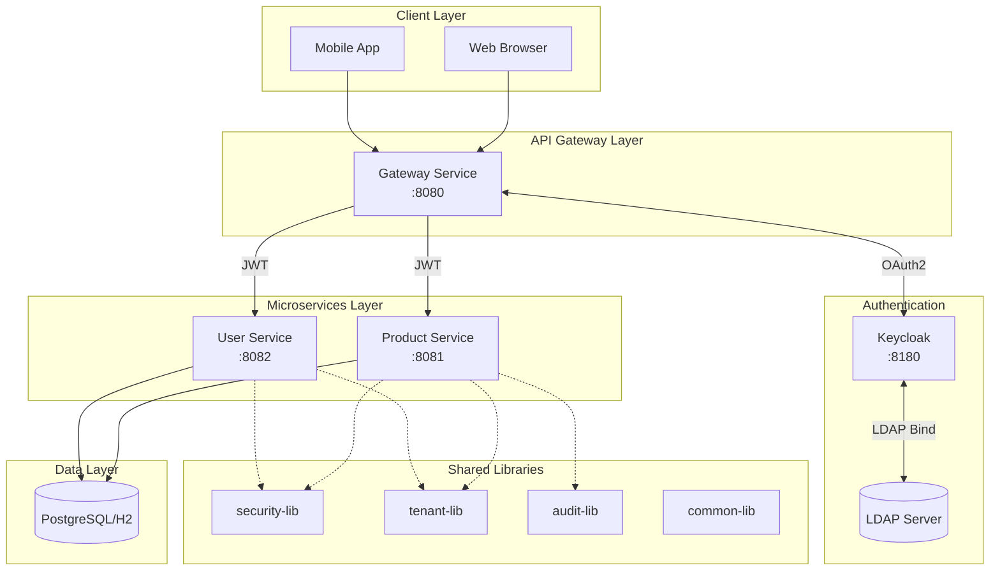

### Hexagonal Architecture (Product Service)

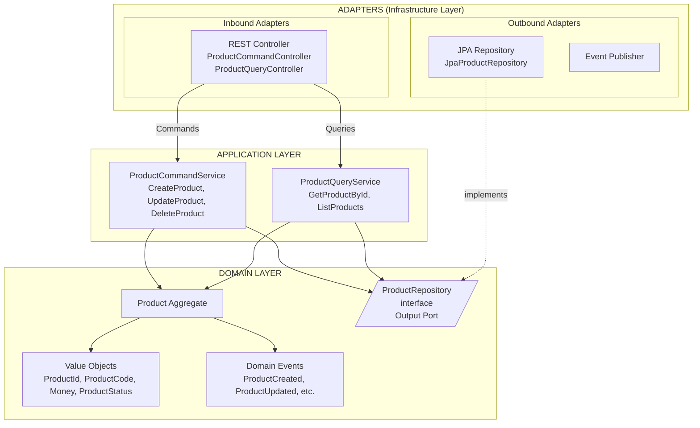

---

## 類別圖

### Domain Layer - Product Aggregate

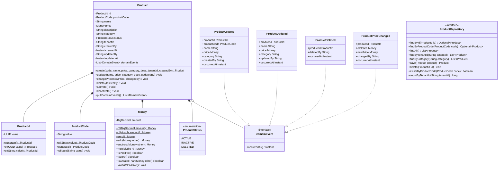

### Application Layer

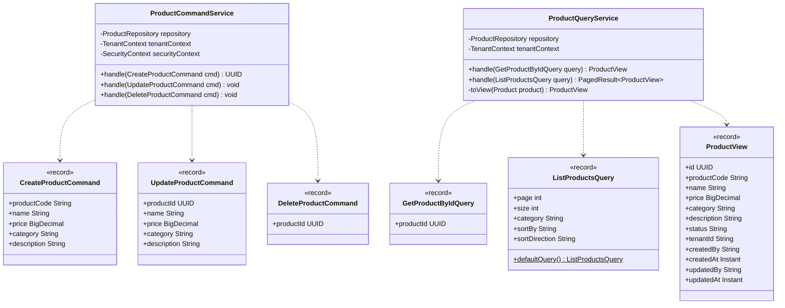

### Adapter Layer

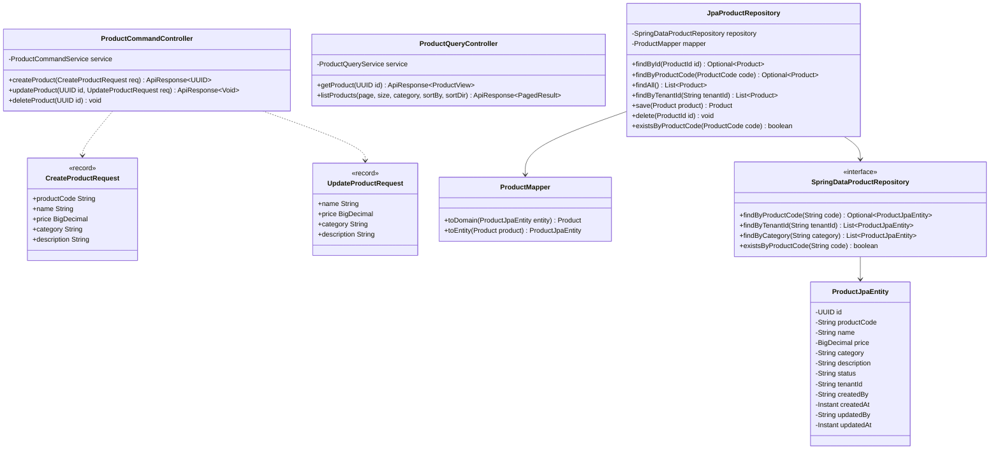

### Audit Library

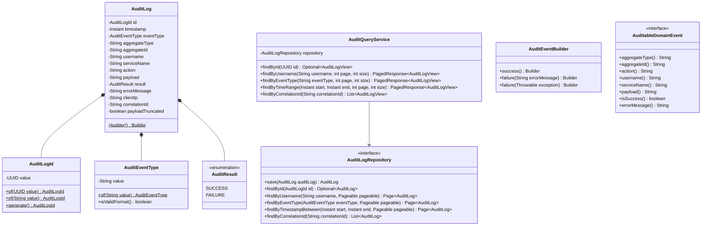

### User Service

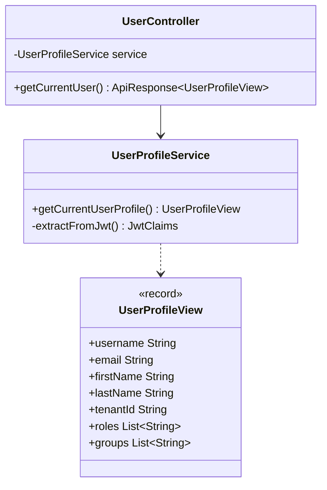

---

## ER Diagram

### 資料庫結構

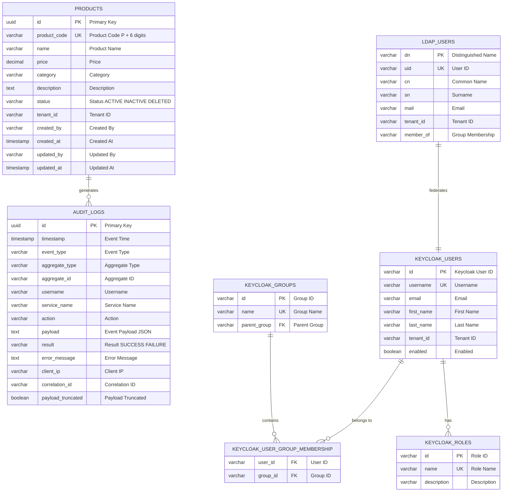

### 索引設計

| 表格 | 索引名稱 | 欄位 | 說明 |
|------|----------|------|------|
| audit_logs | idx_audit_timestamp | timestamp DESC | 時間查詢 |
| audit_logs | idx_audit_username | username, timestamp DESC | 使用者查詢 |
| audit_logs | idx_audit_aggregate | aggregate_type, aggregate_id, timestamp DESC | 聚合查詢 |
| audit_logs | idx_audit_event_type | event_type, timestamp DESC | 事件類型查詢 |
| audit_logs | idx_audit_service | service_name, timestamp DESC | 服務查詢 |
| audit_logs | idx_audit_correlation | correlation_id | 關聯追蹤 |
| audit_logs | idx_audit_result | result, timestamp DESC | 結果篩選 |
| products | idx_products_tenant | tenant_id | 租戶查詢 |
| products | idx_products_category | category | 分類查詢 |
| products | idx_products_code | product_code (UNIQUE) | 代碼查詢 |

---

## 場景序列圖

### 場景 1: 使用者登入認證流程

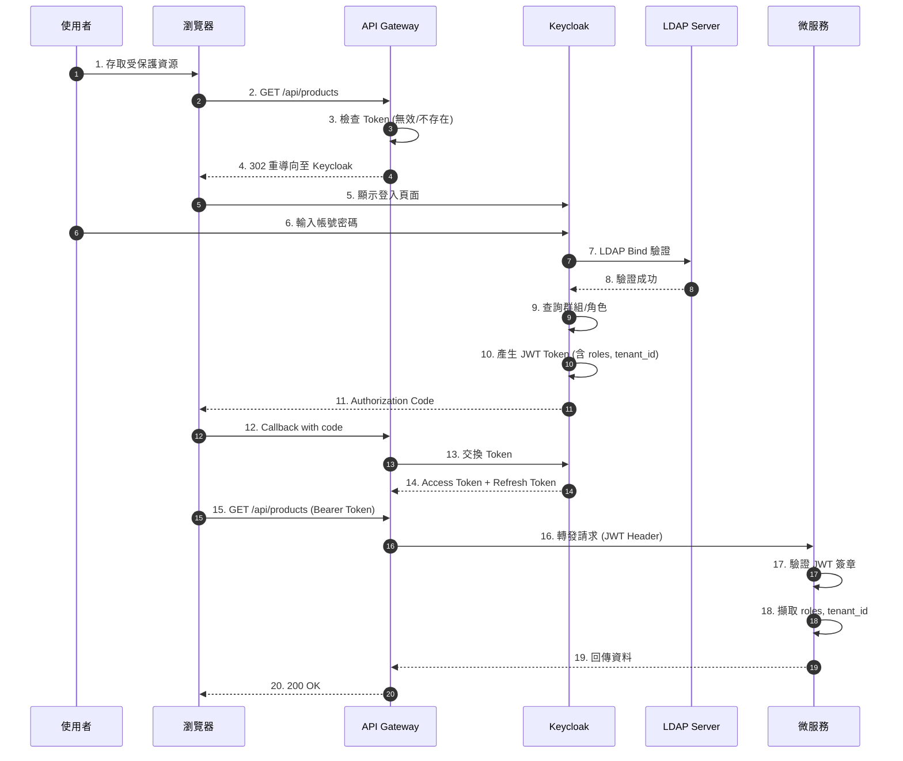

### 場景 2: 建立商品 (含稽核)

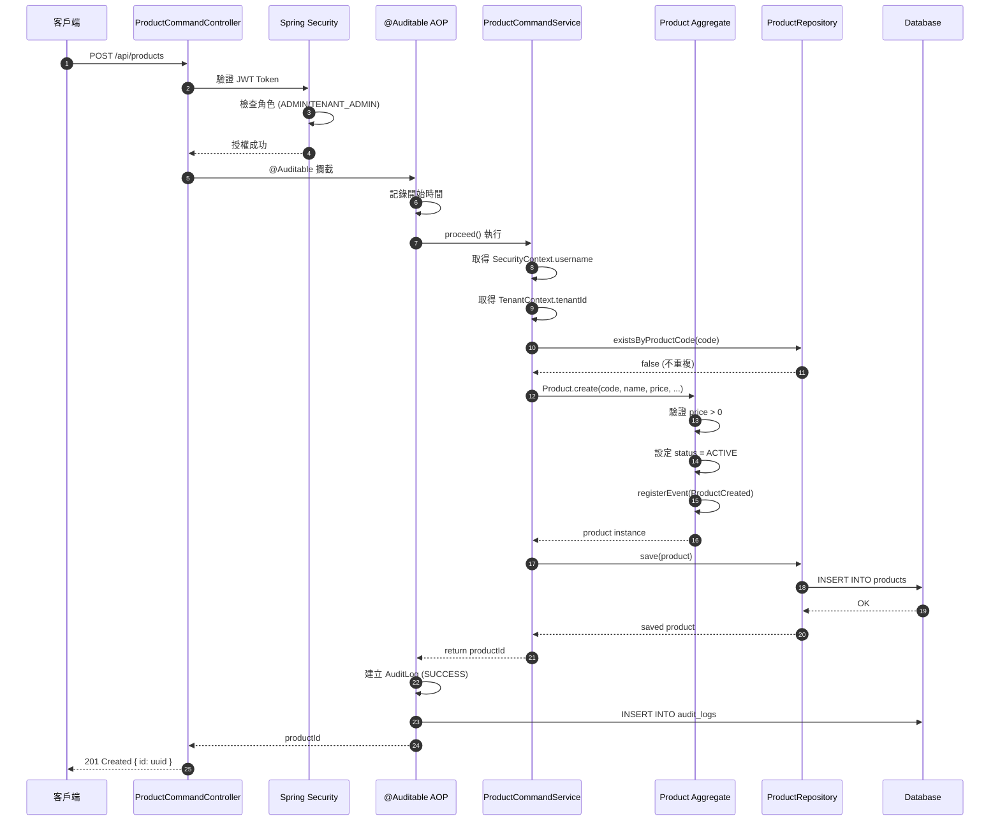

### 場景 3: 多租戶資料隔離


### 場景 4: RBAC 權限驗證失敗

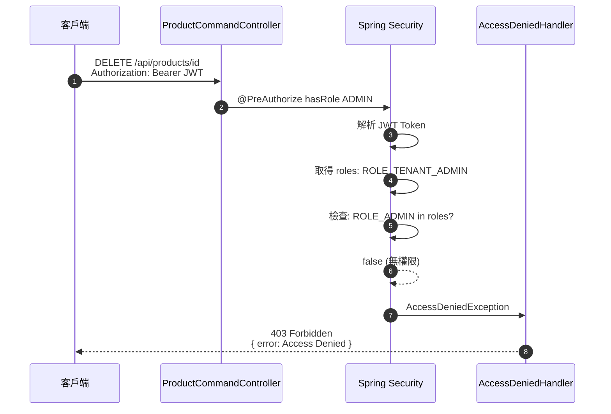

### 場景 5: Domain Event 稽核流程

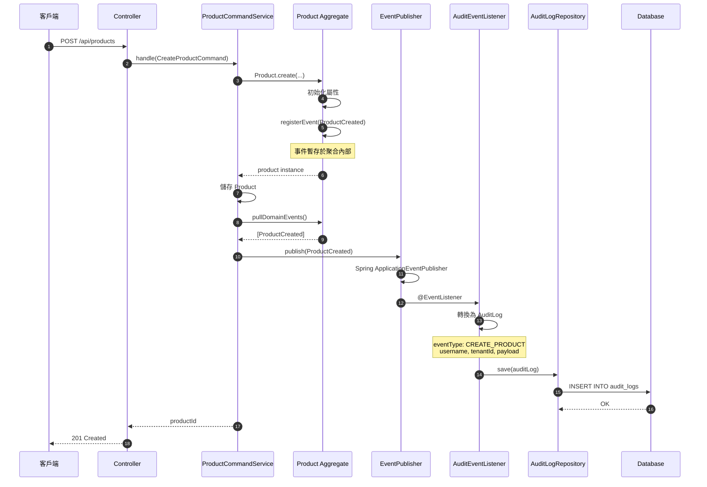

---

## RBAC 權限控制

### 角色層級

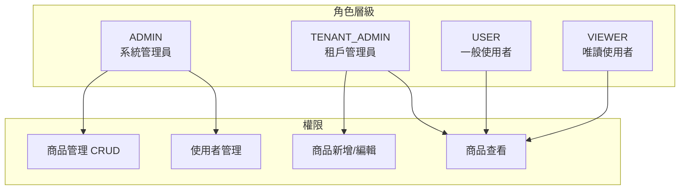

### 權限對照表

| 端點 | ADMIN | TENANT_ADMIN | USER | VIEWER |
|------|:-----:|:------------:|:----:|:------:|
| `GET /api/products` | Yes | Yes | Yes | Yes |
| `GET /api/products/{id}` | Yes | Yes | Yes | Yes |
| `POST /api/products` | Yes | Yes | No | No |
| `PUT /api/products/{id}` | Yes | Yes | No | No |
| `DELETE /api/products/{id}` | Yes | No | No | No |
| `GET /api/users/me` | Yes | Yes | Yes | Yes |
| `GET /api/admin/users` | Yes | No | No | No |

---

## BDD 測試案例

### 商品管理 (product-management.feature)

```gherkin
# language: zh-TW
功能: 商品管理
  作為系統管理員
  我希望能夠管理商品
  以便維護商品目錄

  背景:
    假設 系統已初始化預設資料

  場景: 管理員建立新商品
    假設 使用者 "admin" 已登入系統，角色為 "ADMIN"
    當 使用者建立商品:
      | 商品名稱    | 價格  | 分類     | 描述           |
      | 測試商品 A | 1000  | 電子產品 | 這是測試商品 A |
    那麼 系統應回傳成功訊息
    而且 商品應該被成功建立

  場景: 租戶管理員建立商品
    假設 使用者 "tenant-admin" 已登入系統，角色為 "TENANT_ADMIN"
    當 使用者建立商品:
      | 商品名稱    | 價格 | 分類 | 描述           |
      | 租戶商品 B | 500  | 服飾 | 這是租戶商品 B |
    那麼 系統應回傳成功訊息
    而且 商品應該被成功建立

  場景: 一般使用者無法建立商品
    假設 使用者 "user" 已登入系統，角色為 "USER"
    當 使用者嘗試建立商品:
      | 商品名稱 | 價格 | 分類 | 描述         |
      | 違規商品 | 100  | 其他 | 這不應該成功 |
    那麼 系統應回傳權限不足錯誤

  場景: 管理員查詢商品列表
    假設 使用者 "admin" 已登入系統，角色為 "ADMIN"
    當 使用者查詢所有商品
    那麼 系統應回傳商品列表
    而且 列表應包含預設的 10 筆商品

  場景: 管理員刪除商品
    假設 使用者 "admin" 已登入系統，角色為 "ADMIN"
    而且 系統中存在商品 "待刪除商品"
    當 使用者刪除該商品
    那麼 系統應回傳成功訊息
    而且 商品狀態應該為 "DELETED"
```

### 角色權限控制 (rbac.feature)

```gherkin
# language: zh-TW
功能: 角色權限控制
  作為系統
  我需要根據使用者角色控制存取權限
  以確保系統安全

  場景大綱: 角色存取控制
    假設 使用者 "<使用者>" 已登入系統，角色為 "<角色>"
    當 使用者嘗試存取 "<端點>"
    那麼 系統應回傳 "<結果>"

    例子:
      | 使用者       | 角色         | 端點              | 結果 |
      | admin        | ADMIN        | /api/products     | 200  |
      | admin        | ADMIN        | /api/admin/users  | 200  |
      | tenant-admin | TENANT_ADMIN | /api/products     | 200  |
      | tenant-admin | TENANT_ADMIN | /api/admin/users  | 403  |
      | user         | USER         | /api/products     | 200  |
      | user         | USER         | /api/products/new | 403  |
      | viewer       | VIEWER       | /api/products     | 200  |
      | viewer       | VIEWER       | /api/products/new | 403  |

  場景: 未認證使用者無法存取受保護端點
    假設 使用者未登入
    當 使用者嘗試存取 "/api/products"
    那麼 系統應回傳 "401"

  場景: 無效 Token 被拒絕
    假設 使用者持有無效的 JWT Token
    當 使用者嘗試存取 "/api/products"
    那麼 系統應回傳 "401"
```

### 多租戶資料隔離 (multi-tenant.feature)

```gherkin
# language: zh-TW
功能: 多租戶資料隔離
  作為多租戶系統
  我需要確保不同租戶的資料互相隔離
  以保護租戶資料安全

  背景:
    假設 系統中存在兩個租戶:
      | 租戶 ID  | 租戶名稱 |
      | tenant-a | 租戶 A   |
      | tenant-b | 租戶 B   |

  場景: 租戶只能查看自己的商品
    假設 租戶 "tenant-a" 有商品 "商品 A1" 和 "商品 A2"
    而且 租戶 "tenant-b" 有商品 "商品 B1"
    當 租戶 "tenant-a" 的使用者查詢商品列表
    那麼 只應看到屬於 "tenant-a" 的商品
    而且 不應看到 "tenant-b" 的商品

  場景: 系統管理員可以查看所有租戶商品
    假設 租戶 "tenant-a" 有商品 "商品 A1"
    而且 租戶 "tenant-b" 有商品 "商品 B1"
    當 系統管理員查詢所有商品
    那麼 應看到所有租戶的商品

  場景: 租戶無法存取其他租戶的商品
    假設 租戶 "tenant-a" 有商品 "私密商品"，ID 為 "prod-001"
    當 租戶 "tenant-b" 的使用者嘗試存取商品 "prod-001"
    那麼 系統應回傳資源不存在錯誤
```

---

## 測試案例說明

### 測試統計總覽

| 模組 | 測試類型 | 測試數量 | 覆蓋率 |
|------|----------|:--------:|:------:|
| product-service | Unit Tests | 124 | 96% |
| user-service | Unit Tests | 10 | 96% |
| gateway-service | Unit Tests | 10 | 92% |
| audit-lib | Unit Tests | 150+ | 67% |
| scenario-tests | Cucumber BDD | 18 scenarios | - |
| Docker Integration | Shell Script | 16 | - |
| K8s Integration | Shell Script | 36 | - |
| **Total** | | **344+** | **80%+** |

### Product Service 測試案例

#### Domain Layer 測試

| 測試類別 | 測試案例 | 說明 |
|----------|----------|------|
| `MoneyTest` | shouldCreateMoneyWithValidAmount | 正數金額建立成功 |
| | shouldThrowWhenAmountIsNegative | 負數金額拋出例外 |
| | shouldAddMoneyCorrectly | 加法運算正確 |
| | shouldSubtractMoneyCorrectly | 減法運算正確 |
| | shouldMultiplyMoneyCorrectly | 乘法運算正確 |
| `ProductCodeTest` | shouldCreateValidProductCode | 有效格式 (P + 6位數字) |
| | shouldThrowForInvalidFormat | 無效格式拋出例外 |
| | shouldGenerateUniqueCode | 自動產生唯一代碼 |
| `ProductTest` | shouldCreateProduct | 建立商品並發布 ProductCreated 事件 |
| | shouldUpdateProduct | 更新商品並發布 ProductUpdated 事件 |
| | shouldChangePrice | 變更價格並發布 ProductPriceChanged 事件 |
| | shouldDeleteProduct | 軟刪除並發布 ProductDeleted 事件 |

#### Application Layer 測試

| 測試類別 | 測試案例 | 說明 |
|----------|----------|------|
| `ProductCommandServiceTest` | shouldCreateProductWithProvidedCode | 使用指定商品代碼建立 |
| | shouldGenerateCodeWhenNotProvided | 自動產生商品代碼 |
| | shouldThrowWhenProductCodeExists | 代碼重複時拋出例外 |
| | shouldUpdateProduct | 更新商品資訊 |
| | shouldDeleteProduct | 刪除商品 (狀態變為 DELETED) |
| `ProductQueryServiceTest` | shouldReturnProductWhenFound | 查詢存在的商品 |
| | shouldThrowWhenProductNotFound | 商品不存在時拋出例外 |
| | shouldReturnOnlyTenantProducts | 多租戶資料隔離 |
| | shouldPaginateResults | 分頁功能正確 |

#### Adapter Layer 測試

| 測試類別 | 測試案例 | 說明 |
|----------|----------|------|
| `ProductCommandControllerTest` | shouldReturn401WhenNotAuthenticated | 未認證回傳 401 |
| | shouldReturn403WhenUserRoleInsufficient | 權限不足回傳 403 |
| | shouldCreateProductWhenAdmin | ADMIN 可建立商品 |
| | shouldDeleteProductWhenAdmin | 只有 ADMIN 可刪除 |
| `ProductQueryControllerTest` | shouldReturn401WhenNotAuthenticated | 未認證回傳 401 |
| | shouldReturnProductWhenAuthenticated | 認證後可查詢商品 |

---

## Docker 整合測試

### 執行整合測試

```bash
# 使用整合測試腳本
./deploy/scripts/integration-test.sh

# 手動啟動並測試
docker compose -f deploy/docker/docker-compose.yml up -d
curl http://localhost:8080/actuator/health  # Gateway
curl http://localhost:8081/actuator/health  # Product Service
curl http://localhost:8082/actuator/health  # User Service
```

### 服務端口對照

| 服務 | 端口 | 說明 |
|------|------|------|
| Gateway | 8080 | API 閘道 |
| Product Service | 8081 | 商品管理服務 |
| User Service | 8082 | 使用者服務 |
| Keycloak | 8180 | SSO/OAuth2 認證 |
| phpLDAPadmin | 8181 | LDAP 管理介面 |
| PostgreSQL | 5432 | Keycloak 資料庫 |
| OpenLDAP | 389/636 | 使用者目錄 |

---

## Kubernetes 整合測試

### K8s 測試項目

| 測試類別 | 測試項目 | 數量 |
|----------|----------|:----:|
| Cluster | Kind cluster 存在檢查 | 1 |
| Namespace | rbac-sso namespace 檢查 | 1 |
| Config | ConfigMap 和 Secret 檢查 | 2 |
| PVC | PersistentVolumeClaim 狀態 | 3 |
| Pod 狀態 | 6 個服務 Pod 運行狀態 | 6 |
| Pod Ready | 6 個服務 Pod 就緒狀態 | 6 |
| Service | 6 個 ClusterIP Service | 6 |
| NodePort | 4 個 NodePort Service | 4 |
| 健康檢查 | HTTP 端點檢查 | 4 |
| API 認證 | 401 回應驗證 | 2 |
| Keycloak | Admin Console 可訪問 | 1 |
| **Total** | | **36** |

### 執行 K8s 整合測試

```bash
# 完整部署 (含建置 Docker images)
./deploy/scripts/k8s-deploy.sh --build

# 執行整合測試
./deploy/scripts/k8s-integration-test.sh

# 刪除 cluster
./deploy/scripts/k8s-deploy.sh --delete
```

---

## mTLS 東西向安全 (Spring Boot + cert-manager)

### 架構概述

本專案實作了基於 Spring Boot SSL Bundle + cert-manager 的 mTLS (Mutual TLS) 方案，用於服務間的雙向認證和加密通訊。

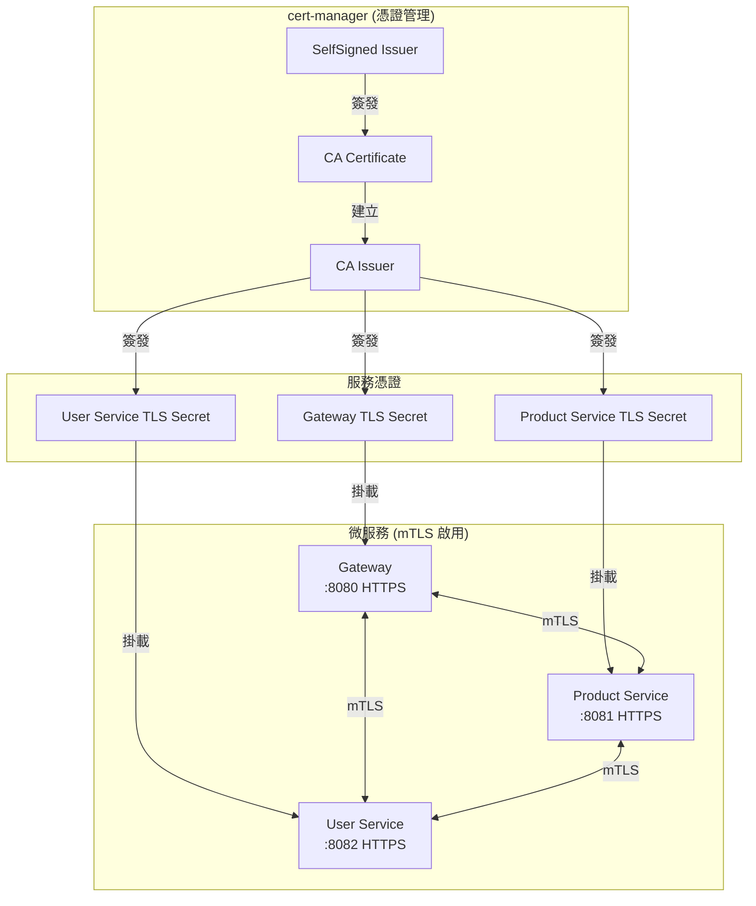

### 憑證結構

```
/etc/ssl/certs/
├── tls.crt      # 服務憑證 (由 CA 簽發)
├── tls.key      # 私鑰
└── ca.crt       # CA 憑證 (用於驗證對方服務)
```

### mTLS 配置檔案

| 檔案路徑 | 說明 |
|----------|------|
| `deploy/k8s/security/cert-manager/ca-issuer.yaml` | CA Issuer 和根憑證配置 |
| `deploy/k8s/security/cert-manager/service-certificates.yaml` | 各服務的憑證申請 |
| `deploy/k8s/services-mtls/*.yaml` | mTLS 啟用的 K8s 部署配置 |
| `services/*/src/main/resources/application-mtls.yml` | Spring Boot mTLS 配置 |
| `libs/audit-lib/.../MtlsWebClientConfiguration.java` | mTLS WebClient 配置類 |

### Spring Boot SSL Bundle 配置

```yaml
# application-mtls.yml
server:
  port: 8081
  ssl:
    enabled: true
    certificate: /etc/ssl/certs/tls.crt
    certificate-private-key: /etc/ssl/certs/tls.key
    client-auth: need  # 強制客戶端憑證驗證
    trust-store: /etc/ssl/certs/ca.crt
    enabled-protocols: TLSv1.3,TLSv1.2

spring:
  ssl:
    bundle:
      pem:
        mtls-bundle:
          keystore:
            certificate: /etc/ssl/certs/tls.crt
            private-key: /etc/ssl/certs/tls.key
          truststore:
            certificate: /etc/ssl/certs/ca.crt
```

### cert-manager 憑證資源

```yaml
# service-certificates.yaml
apiVersion: cert-manager.io/v1
kind: Certificate
metadata:
  name: product-service-tls
  namespace: rbac-sso
spec:
  secretName: product-service-tls-secret
  duration: 8760h    # 1 年
  renewBefore: 720h  # 30 天前自動更新
  commonName: product-service
  privateKey:
    algorithm: ECDSA
    size: 256
  usages:
    - server auth
    - client auth
  dnsNames:
    - product-service
    - product-service.rbac-sso.svc.cluster.local
  issuerRef:
    name: rbac-sso-ca-issuer
    kind: ClusterIssuer
```

### 使用 mTLS WebClient

```java
@Autowired
@Qualifier("mtlsWebClient")
private WebClient mtlsWebClient;

// 呼叫其他服務 (自動帶客戶端憑證)
String response = mtlsWebClient.get()
    .uri("https://product-service:8081/api/products")
    .retrieve()
    .bodyToMono(String.class)
    .block();
```

### 部署 mTLS 環境

```bash
# 1. 安裝 cert-manager
./deploy/scripts/k8s-mtls-deploy.sh --install-cert-manager

# 2. 部署含 mTLS 的服務 (需先建置 Docker images)
./deploy/scripts/k8s-mtls-deploy.sh --build

# 3. 驗證 mTLS 連線
./deploy/scripts/k8s-mtls-deploy.sh --verify

# 4. 查看憑證狀態
kubectl get certificates -n rbac-sso
```

### 安全控管狀態

| 層級 | 控制項 | 狀態 | 說明 |
|------|--------|:----:|------|
| **南北向** | OAuth2/OIDC | Done | Keycloak 整合 |
| | JWT 驗證 | Done | Spring Security |
| | RBAC 權限控制 | Done | 角色基礎存取控制 |
| **東西向** | OAuth2 Client Credentials | Done | ServiceTokenProvider |
| | mTLS | Done | Spring Boot + cert-manager |
| | 憑證自動更新 | Done | cert-manager renewBefore |

### mTLS 序列圖

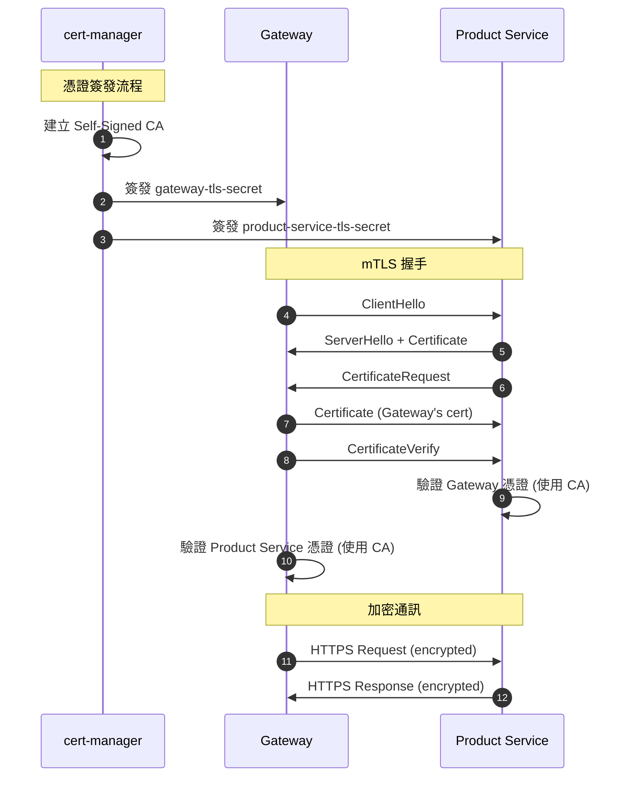

---

## Keycloak LDAP 整合教學

### Step 1: 安裝 Keycloak

```bash
docker run -d --name keycloak \
  -p 8180:8080 \
  -e KEYCLOAK_ADMIN=admin \
  -e KEYCLOAK_ADMIN_PASSWORD=admin \
  quay.io/keycloak/keycloak:24.0 start-dev
```

### Step 2: 設定 LDAP User Federation

| 設定項 | 值 |
|--------|-----|
| Vendor | Other |
| Connection URL | `ldap://ldap-server:389` |
| Bind DN | `cn=admin,dc=example,dc=com` |
| Users DN | `ou=users,dc=example,dc=com` |
| Username LDAP attribute | `uid` |

### Step 3: 應用程式設定

```yaml
spring:
  security:
    oauth2:
      resourceserver:
        jwt:
          issuer-uri: http://localhost:8180/realms/ecommerce
```

---

## 快速開始

### 環境需求

- Java 17+
- Gradle 8.5+
- Docker
- Kind (for K8s testing)

### 建置與測試

```bash
# 編譯專案
./gradlew build

# 執行所有測試
./gradlew test

# 產生測試覆蓋率報告
./gradlew jacocoTestReport
```

### 啟動服務

```bash
# 啟動 Gateway Service (Port 8080)
./gradlew :services:gateway-service:bootRun

# 啟動 Product Service (Port 8081)
./gradlew :services:product-service:bootRun

# 啟動 User Service (Port 8082)
./gradlew :services:user-service:bootRun
```

---

## 專案結構

```
rbac-sso-poc/
├── libs/                           # 共用函式庫
│   ├── common-lib/                 # 共用 DTO、Exception
│   ├── security-lib/               # OAuth2 安全設定
│   ├── tenant-lib/                 # 多租戶支援
│   └── audit-lib/                  # 稽核日誌
│       ├── domain/                 # AuditLog, AuditLogId, AuditEventType
│       ├── application/            # AuditQueryService
│       └── infrastructure/         # JPA 實作
│
├── services/                       # 微服務
│   ├── product-service/            # 商品服務 (:8081)
│   │   └── src/main/java/.../
│   │       ├── domain/             # Product, ProductId, Money, ProductCode
│   │       ├── application/        # CommandService, QueryService
│   │       └── adapter/            # REST Controllers, JPA
│   ├── user-service/               # 使用者服務 (:8082)
│   └── gateway-service/            # API 閘道 (:8080)
│
├── tests/                          # 測試
│   └── scenario-tests/             # Cucumber BDD 測試
│       └── features/               # .feature 檔案
│
├── deploy/                         # 部署設定
│   ├── docker/                     # Docker Compose
│   ├── k8s/                        # Kubernetes
│   └── scripts/                    # 部署腳本
│
├── specs/                          # Spec Kit 規格文件
├── PRD.md                          # 產品需求文件
├── TECH.md                         # 技術架構文件
├── INFRA.md                        # 基礎設施文件
└── README.md                       # 本文件
```

---

## 技術堆疊

| 類別 | 技術 | 版本 |
|------|------|------|
| 語言 | Java | 17 |
| 框架 | Spring Boot | 3.3.x |
| 安全 | Spring Security OAuth2 | 6.x |
| 資料存取 | Spring Data JPA | 3.3.x |
| 閘道 | Spring Cloud Gateway | 4.x |
| 認證 | Keycloak | 24.x |
| 資料庫 | PostgreSQL / H2 | 15 / 2.x |
| 測試 | JUnit 5, Mockito, Cucumber | 5.x |
| 架構測試 | ArchUnit | 1.2.x |
| 容器 | Docker, Kubernetes | - |
| 建置 | Gradle | 8.5 |

---

## License

Private - Internal Use Only
