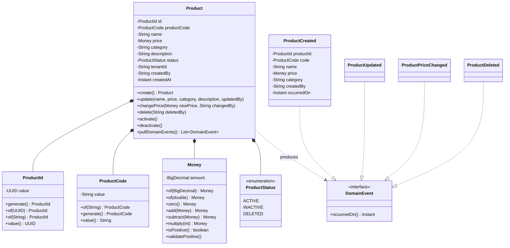

# RBAC-SSO-POC

多租戶電子商務平台 POC - 基於 Hexagonal Architecture 的 RBAC + SSO 實作，整合 Keycloak LDAP 認證與稽核功能。

## 目錄

- [專案概述](#專案概述)
- [系統架構](#系統架構)
- [RBAC 權限控制](#rbac-權限控制)
- [Keycloak LDAP 整合教學](#keycloak-ldap-整合教學)
- [微服務說明](#微服務說明)
- [UML 圖表](#uml-圖表)
- [快速開始](#快速開始)
- [測試](#測試)
- [專案結構](#專案結構)

## 專案概述

本專案實作多租戶電子商務平台的核心功能，展示以下技術概念：

### 核心特性

| 特性 | 說明 |
|------|------|
| **多租戶架構** | 租戶資料隔離，TenantContext 管理 |
| **RBAC 權限控制** | 基於角色的存取控制，整合 Spring Security |
| **SSO 單一登入** | OAuth2/OIDC + Keycloak 整合 |
| **Hexagonal Architecture** | 六角架構，Ports & Adapters 模式 |
| **DDD 領域驅動設計** | Aggregate、Value Objects、Domain Events |
| **CQRS 模式** | 命令/查詢分離 |
| **稽核日誌** | Spring AOP / Domain Event 雙機制 |

### 分支說明

| 分支 | 稽核機制 | 說明 |
|------|----------|------|
| `main` | Spring AOP | 透過 `@Auditable` 註解自動攔截，適合簡單場景 |
| `domain-event-for-audit` | Domain Event | 透過領域事件發布，提供更細緻的控制 |

> 兩個分支的 RBAC、SSO、多租戶等核心功能完全一致，僅稽核日誌實作方式不同。

## 系統架構

### 整體架構


### Hexagonal Architecture (Product Service)


## RBAC 權限控制

### 角色定義


### 權限對照表

| 端點 | ADMIN | TENANT_ADMIN | USER | VIEWER |
|------|:-----:|:------------:|:----:|:------:|
| `GET /api/products` | ✅ | ✅ | ✅ | ✅ |
| `GET /api/products/{id}` | ✅ | ✅ | ✅ | ✅ |
| `POST /api/products` | ✅ | ✅ | ❌ | ❌ |
| `PUT /api/products/{id}` | ✅ | ✅ | ❌ | ❌ |
| `DELETE /api/products/{id}` | ✅ | ❌ | ❌ | ❌ |
| `GET /api/admin/users` | ✅ | ❌ | ❌ | ❌ |

### Spring Security 設定

```java
@PreAuthorize("hasAnyRole('ADMIN', 'TENANT_ADMIN')")
@PostMapping
public ApiResponse<UUID> createProduct(@RequestBody CreateProductRequest req) {
    // ...
}

@PreAuthorize("hasRole('ADMIN')")
@DeleteMapping("/{id}")
public ApiResponse<Void> deleteProduct(@PathVariable UUID id) {
    // ...
}
```

## Keycloak LDAP 整合教學

### 架構概覽


### Step 1: 安裝 Keycloak

```bash
# 使用 Docker 啟動 Keycloak
docker run -d --name keycloak \
  -p 8180:8080 \
  -e KEYCLOAK_ADMIN=admin \
  -e KEYCLOAK_ADMIN_PASSWORD=admin \
  quay.io/keycloak/keycloak:23.0 start-dev
```

### Step 2: 建立 Realm

1. 登入 Keycloak Admin Console: `http://localhost:8180/admin`
2. 建立新 Realm: `ecommerce`

### Step 3: 設定 LDAP User Federation

1. 進入 **User Federation** > **Add provider** > **ldap**
2. 填入以下設定：

| 設定項 | 值 |
|--------|-----|
| Vendor | Other |
| Connection URL | `ldap://ldap-server:389` |
| Bind DN | `cn=admin,dc=example,dc=com` |
| Bind Credential | (管理員密碼) |
| Users DN | `ou=users,dc=example,dc=com` |
| Username LDAP attribute | `uid` |
| UUID LDAP attribute | `entryUUID` |
| User Object Classes | `inetOrgPerson, organizationalPerson` |

### Step 4: 設定 LDAP Mapper (角色同步)

1. 在 LDAP 設定頁面 > **Mappers** > **Create**
2. 建立 Group Mapper：

| 設定項 | 值 |
|--------|-----|
| Name | `ldap-group-mapper` |
| Mapper Type | `group-ldap-mapper` |
| LDAP Groups DN | `ou=groups,dc=example,dc=com` |
| Group Object Classes | `groupOfNames` |
| Membership LDAP Attribute | `member` |
| Mode | `READ_ONLY` |

### Step 5: 建立 Client

1. 進入 **Clients** > **Create client**
2. 設定：

| 設定項 | 值 |
|--------|-----|
| Client ID | `ecommerce-app` |
| Client Protocol | `openid-connect` |
| Access Type | `confidential` |
| Valid Redirect URIs | `http://localhost:8080/*` |

### Step 6: 設定 Tenant Mapper (Custom Claim)

建立 Protocol Mapper 將租戶 ID 加入 Token：

1. **Clients** > `ecommerce-app` > **Client scopes** > **Dedicated scope**
2. **Add mapper** > **By configuration** > **User Attribute**

| 設定項 | 值 |
|--------|-----|
| Name | `tenant_id` |
| User Attribute | `tenant_id` |
| Token Claim Name | `tenant_id` |
| Claim JSON Type | `String` |
| Add to ID token | ✅ |
| Add to access token | ✅ |

### Step 7: 應用程式設定

```yaml
# application.yml
spring:
  security:
    oauth2:
      resourceserver:
        jwt:
          issuer-uri: http://localhost:8180/realms/ecommerce
          jwk-set-uri: http://localhost:8180/realms/ecommerce/protocol/openid-connect/certs

keycloak:
  auth-server-url: http://localhost:8180
  realm: ecommerce
  resource: ecommerce-app
  credentials:
    secret: ${KEYCLOAK_CLIENT_SECRET}
```

### LDAP 目錄結構範例

```ldif
# 組織結構
dn: dc=example,dc=com
objectClass: organization
o: Example Inc

dn: ou=users,dc=example,dc=com
objectClass: organizationalUnit
ou: users

dn: ou=groups,dc=example,dc=com
objectClass: organizationalUnit
ou: groups

# 使用者
dn: uid=admin,ou=users,dc=example,dc=com
objectClass: inetOrgPerson
uid: admin
cn: System Admin
sn: Admin
mail: admin@example.com
userPassword: {SSHA}xxxxx

# 群組 (對應 Keycloak 角色)
dn: cn=admins,ou=groups,dc=example,dc=com
objectClass: groupOfNames
cn: admins
member: uid=admin,ou=users,dc=example,dc=com
```

## 微服務說明

### Product Service (:8081)

完整 DDD 實作的商品管理服務。

**API 端點：**

| 方法 | 端點 | 說明 | 權限 |
|------|------|------|------|
| GET | `/api/products` | 查詢商品列表 | 已認證 |
| GET | `/api/products/{id}` | 查詢單一商品 | 已認證 |
| POST | `/api/products` | 建立商品 | ADMIN, TENANT_ADMIN |
| PUT | `/api/products/{id}` | 更新商品 | ADMIN, TENANT_ADMIN |
| DELETE | `/api/products/{id}` | 刪除商品 | ADMIN |

**Domain Model：**

```java
// Product Aggregate
public class Product {
    private ProductId id;
    private ProductCode productCode;
    private String name;
    private Money price;
    private String category;
    private ProductStatus status;
    private String tenantId;

    // Domain Events
    public static Product create(...) {
        registerEvent(new ProductCreated(...));
    }
}
```

### User Service (:8082)

使用者個人資料服務。

**API 端點：**

| 方法 | 端點 | 說明 | 權限 |
|------|------|------|------|
| GET | `/api/users/me` | 取得當前使用者資訊 | 已認證 |

### Gateway Service (:8080)

Spring Cloud Gateway 路由閘道。

**路由規則：**

```yaml
spring:
  cloud:
    gateway:
      routes:
        - id: product-service
          uri: http://localhost:8081
          predicates:
            - Path=/api/products/**
        - id: user-service
          uri: http://localhost:8082
          predicates:
            - Path=/api/users/**
```

## UML 圖表

### 類別圖 - Product Domain



### 類別圖 - Application Layer


### 序列圖 - 建立商品


### 序列圖 - 多租戶資料隔離


### 序列圖 - OAuth2 認證流程


### 序列圖 - 稽核日誌 (Spring AOP)


### 序列圖 - 稽核日誌 (Domain Event)


### 類別圖 - Audit Lib


## 快速開始

### 環境需求

- Java 17+
- Gradle 8.5+
- Docker (for Keycloak)

### 建置專案

```bash
# 編譯
./gradlew build

# 執行測試
./gradlew test

# 啟動 Product Service
./gradlew :services:product-service:bootRun

# 啟動 User Service
./gradlew :services:user-service:bootRun

# 啟動 Gateway Service
./gradlew :services:gateway-service:bootRun
```

### Docker Compose (完整環境)

```yaml
version: '3.8'
services:
  keycloak:
    image: quay.io/keycloak/keycloak:23.0
    ports:
      - "8180:8080"
    environment:
      KEYCLOAK_ADMIN: admin
      KEYCLOAK_ADMIN_PASSWORD: admin
    command: start-dev

  postgres:
    image: postgres:15
    ports:
      - "5432:5432"
    environment:
      POSTGRES_DB: ecommerce
      POSTGRES_USER: postgres
      POSTGRES_PASSWORD: postgres

  gateway:
    build: ./services/gateway-service
    ports:
      - "8080:8080"
    depends_on:
      - keycloak

  product-service:
    build: ./services/product-service
    ports:
      - "8081:8081"
    depends_on:
      - postgres

  user-service:
    build: ./services/user-service
    ports:
      - "8082:8082"
```

## 測試

### 測試統計

| 模組 | 測試類型 | 數量 |
|------|----------|------|
| product-service | Unit Tests | ~45 |
| user-service | Unit Tests | ~9 |
| gateway-service | Unit Tests | ~5 |
| scenario-tests | Cucumber BDD | 18 |
| rbac-demo | Integration | ~200+ |
| **總計** | | **294** |

### 執行測試

```bash
# 執行所有測試
./gradlew test

# 執行特定服務測試
./gradlew :services:product-service:test

# 執行 Cucumber 情境測試
./gradlew :tests:scenario-tests:test
```

### Cucumber 測試場景

```gherkin
# language: zh-TW
功能: 角色權限控制

  場景大綱: 角色存取控制
    假設 使用者 "<使用者>" 已登入系統，角色為 "<角色>"
    當 使用者嘗試存取 "<端點>"
    那麼 系統應回傳 "<結果>"

    例子:
      | 使用者        | 角色         | 端點              | 結果 |
      | admin        | ADMIN        | /api/products     | 200  |
      | admin        | ADMIN        | /api/admin/users  | 200  |
      | tenant-admin | TENANT_ADMIN | /api/admin/users  | 403  |
      | user         | USER         | /api/products/new | 403  |
```

## 專案結構

```
rbac-sso-poc/
├── libs/                           # 共用函式庫
│   ├── common-lib/                 # 共用 DTO、Exception
│   ├── security-lib/               # OAuth2 安全設定
│   ├── tenant-lib/                 # 多租戶支援
│   └── audit-lib/                  # 稽核日誌
│
├── services/                       # 微服務
│   ├── product-service/            # 商品服務 (:8081)
│   │   └── src/main/java/.../product/
│   │       ├── domain/             # 領域層
│   │       │   ├── model/aggregate/Product.java
│   │       │   ├── model/valueobject/
│   │       │   ├── event/
│   │       │   └── repository/ProductRepository.java
│   │       ├── application/        # 應用層
│   │       │   ├── service/
│   │       │   ├── port/input/command/
│   │       │   ├── port/input/query/
│   │       │   └── dto/
│   │       └── adapter/            # 介面層
│   │           ├── inbound/rest/
│   │           └── outbound/persistence/
│   │
│   ├── user-service/               # 使用者服務 (:8082)
│   └── gateway-service/            # API 閘道 (:8080)
│
├── apps/                           # 應用程式
│   └── rbac-demo/                  # RBAC 示範應用
│
├── tests/                          # 測試
│   └── scenario-tests/             # Cucumber BDD 測試
│
├── docs/                           # 文件
│   ├── PRD.md                      # 產品需求文件
│   └── TECH.md                     # 技術規格文件
│
├── build.gradle                    # 根建置檔
├── settings.gradle                 # 專案設定
└── README.md                       # 本文件
```

## 技術堆疊

| 類別 | 技術 | 版本 |
|------|------|------|
| 語言 | Java | 17 |
| 框架 | Spring Boot | 3.3.x |
| 安全 | Spring Security OAuth2 | 6.x |
| 資料存取 | Spring Data JPA | 3.3.x |
| 閘道 | Spring Cloud Gateway | 4.x |
| 認證 | Keycloak | 23.x |
| 資料庫 | PostgreSQL / H2 | 15 / 2.x |
| 測試 | JUnit 5, Mockito, Cucumber | 5.x |
| 建置 | Gradle | 8.5 |

## License

Private - Internal Use Only
